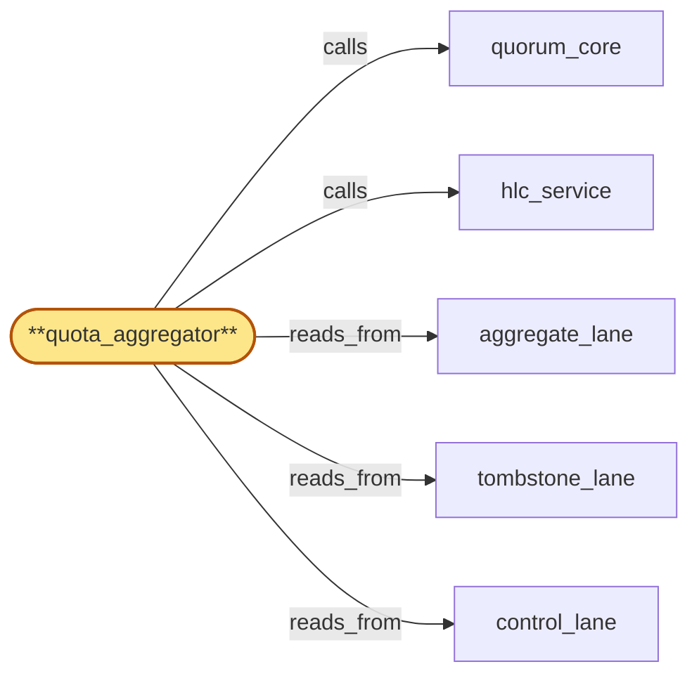

# quota_aggregator

> Build the cross-region quota aggregator:

## Properties

| Field | Value |
| --- | --- |
| Task | `quota_aggregator` |
| Scope | `region_coordinator` |
| Node | `quota_aggregator` |
| Node type | `Subservice` |
| Dependencies | `2` |
| Wave | `3` |

## Architecture

## Implementation summary

- Build the cross-region quota aggregator: aggregates per-tenant per-region counters into global view
- pre-aggregation buffer
- shed-by-class on overflow.

## Node definition (`quota_aggregator` — Subservice)

- Receives sub-second per-(tenant, plan_version, tenant_cluster) usage deltas from every region's usage_meter.
- Bucketed by HLC time via hlc_service, not wall-clock.
- Pre-aggregates incoming deltas in-memory by (tenant, plan_version, tenant_cluster, HLC bucket) before proposing to aggregate_lane, so consensus throughput on aggregate_lane scales with bucket count rather than raw delta arrival rate.
- Maintains rolling aggregates committed via quorum_core into aggregate_lane.
- Reads aggregate_lane (own state), tombstone_lane (cluster suspensions to factor into ceiling computation), control_lane (in-force plan_version, residency policy).
- When the pre-aggregation buffer exceeds a documented watermark, sheds by ceiling-proximity class: aggregates well under the per-plan ceiling are dropped first with a loss-attestation
- aggregates near or crossing a ceiling retain admission priority into aggregate_lane so throttle-flag tombstones are not delayed by low-severity delta floods.
- Crossing a per-plan ceiling or per-cluster quota proposes a throttle-flag tombstone via quorum_core into tombstone_lane.
- On partition, minority-region quota_aggregator buffers incoming deltas under a bounded watermark (overflow: alert-escalation for any aggregate that would exceed a ceiling, drop-with-loss-attestation otherwise)
- on heal, buffered deltas replay with idempotency keys. (Realizes IR-quota-aggregation
- lane-aware.)

## Requirements

### `r1` — IR-quota-aggregation

**Summary:** Per-(tenant, plan_version, tenant_cluster) usage deltas reported by every region's usage_meter are aggregated globally on a sub-second cadence, and crossing a per-plan ceiling or per-cluster quota proposes a throttle-flag tombstone.

- Origin: `initial`
- Targets: `quota_aggregator`
- Matched via: `quota_aggregator`
- Verifications:
  - Test quota_aggregator/aggregation.rs asserts cross-region per-tenant aggregation lands in aggregate_lane within HLC window.

### `r2` — SR2-quota-pre-aggregation

**Summary:** quota_aggregator pre-aggregates incoming usage deltas in-memory by (tenant, plan_version, tenant_cluster, HLC bucket) before proposing to aggregate_lane, so consensus throughput on aggregate_lane scales with bucket count rather than raw delta arrival rate.

- Origin: `stressor:2:aggregate-lane-backpressure`
- Targets: `quota_aggregator`
- Matched via: `quota_aggregator`
- Verifications:
  - Test quota_aggregator/pre_aggregation.rs asserts pre-aggregation buffer cuts noise before commit.

### `r3` — SR2-quota-shed-by-class

**Summary:** When the pre-aggregation buffer exceeds a documented watermark, quota_aggregator sheds by ceiling-proximity class: aggregates well under the per-plan ceiling are dropped first with a loss-attestation; aggregates near or crossing a ceiling retain admission priority into aggregate_lane so throttle-flag tombstones are not delayed by low-severity delta floods.

- Origin: `stressor:2:aggregate-lane-backpressure`
- Targets: `quota_aggregator`
- Matched via: `quota_aggregator`
- Verifications:
  - Test quota_aggregator/shed_by_class.rs asserts on overflow, lower-class entries shed first per documented policy.

## Outputs

| Path | Purpose |
| --- | --- |
| `crates/region_coordinator/src/quota_aggregator.rs` | Aggregator core |

## Stack details

- Rust module 'region_coordinator::quota_aggregator' running periodic aggregation against aggregate_lane; tracks per-tenant global usage with HLC-stamped delta reports from usage_meter

## Acceptance criteria

### IR-quota-aggregation

- Test quota_aggregator/aggregation.rs asserts cross-region per-tenant aggregation lands in aggregate_lane within HLC window.

### SR2-quota-pre-aggregation

- Test quota_aggregator/pre_aggregation.rs asserts pre-aggregation buffer cuts noise before commit.

### SR2-quota-shed-by-class

- Test quota_aggregator/shed_by_class.rs asserts on overflow, lower-class entries shed first per documented policy.

## Related tasks (graph neighbours)

- [aggregate_lane](aggregate_lane.md)
- [control_lane](control_lane.md)
- [hlc_service](hlc_service.md)
- [quorum_core](quorum_core.md)
- [tombstone_lane](tombstone_lane.md)

---

_Source of truth: `archi plan task show quota_aggregator`. Regenerate with `python3 tasks/_generate.py`._
