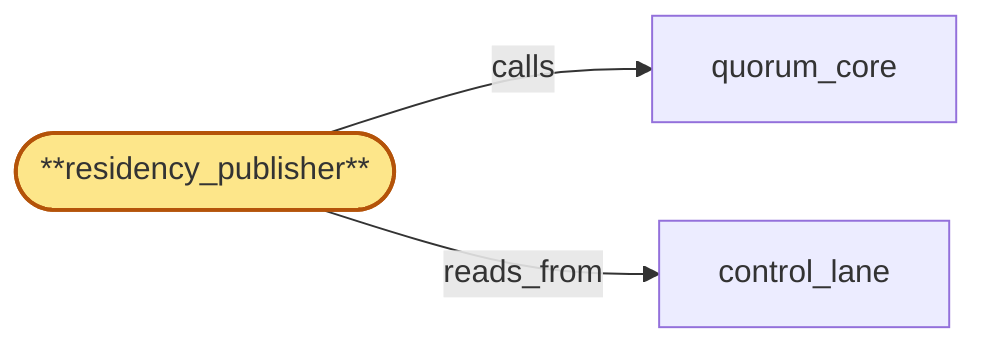

# residency_publisher

> Build the residency-policy publisher:

## Properties

| Field | Value |
| --- | --- |
| Task | `residency_publisher` |
| Scope | `region_coordinator` |
| Node | `residency_publisher` |
| Node type | `Subservice` |
| Dependencies | `2` |
| Wave | `3` |

## Architecture

## Implementation summary

- Build the residency-policy publisher: M-of-regions quorum-witnessed CAS activation of policy_version
- push-and-acknowledge channel
- deny-by-default on missed ack
- pre-warm hydration on cold-start
- 2PC with tenant_store
- prepared-window dynamic
- roster-pin includes activation.

## Node definition (`residency_publisher` — Subservice)

- Owns each tenant's residency policy with explicit version + effective-from HLC stamp.
- Resolves policy from tenant_store (parent), commits new versions via quorum_core into control_lane, and pushes new versions to every consumer (edge, gateway, usage_meter, metrics_store at parent scope).
- Tightening changes (narrowing allowed regions) are a 2PC at zoom: (PREPARE) residency_publisher commits a prepared-V+1 entry to control_lane bound to a per-tenant quarantine-and-relocate-complete-ack precondition.
- PREPARE pins the active roster_version captured from credential_roster's published state in control_lane AND records the rotation-activation-HLC observed at PREPARE (s4-7)
- COMMIT and ABORT proposals carry both the pinned roster_version and the pinned activation HLC, not the current ones.
- If a credential_roster rotation-activate would land before the in-flight COMMIT (i.e., a new rotation-activation-HLC strictly greater than the pinned activation HLC is observable in control_lane while the 2PC is still in PREPARE state), the 2PC MUST either complete before the new activation HLC or transition to residency-2PC-cancel-and-abort under elevated-tier-A directive issued via lifecycle_gate.
- Per-tenant residency-2PC-in-flight lock: residency_publisher acquires a per-tenant lock at lifecycle_gate (CAS-committed to control_lane) on PREPARE commit
- competing PREPARE for same tenant T is CAS-rejected with reason 'residency-2PC-already-in-flight'.
- The prepared-window is per-(tenant_key, V+1) and dynamically sized: tenant_store reports estimated_quarantine_duration in a preliminary PREPARE-estimate exchange before the PREPARE proposal commits
- residency_publisher computes prepared-window = max(min-window, estimated_duration * documented_safety_margin) capped at absolute-max-window
- estimate bounded above and below by per-tenant quotas published in control_lane. residency_publisher may extend the prepared-window once before absolute-max-window if tenant_store progress reports indicate observable progress
- the extension itself is committed as a prepared-window-extended entry to control_lane and operator-visible. tenant_store performs the quarantine-and-relocate and emits an HLC-stamped prepared-ack via its parent-scope writes-to-region_coordinator path
- residency_publisher writes the prepared-ack record to control_lane.
- Without prepared-ack, residency_publisher MUST NOT proceed.
- (COMMIT) M-of-regions quorum-witnessed CAS activates V+1: residency_publisher proposes activate-V+1 via quorum_core carrying the pinned roster_version and the pinned rotation-activation-HLC
- commit re-validates prepared-ack still observable AND per-region push-and-acknowledge ack quorum is met AND pinned roster_version is at-or-above the consumer-acked roster_version at commit-HLC AND no strictly-newer rotation-activation-HLC has landed in control_lane than the pinned one (else the COMMIT MUST be redirected to ABORT or to residency-2PC-cancel-and-abort per the cross-version sequencing rule).
- On commit, residency_publisher broadcasts V+1 active to all consumers via push-and-acknowledge channel
- the residency-2PC-in-flight lock releases.
- (ABORT) On prepared-window expiry without commit, residency_publisher CAS-commits an abort-V+1 entry under (tenant_key, V+1, attempt_id) idempotency: same abort_id twice is a no-op
- strictly newer attempt_id starts fresh from V's current state ONLY if the prior attempt has reached terminal state (abort committed AND tenant_store reports clean-rollback-complete).
- The lock releases on abort.
- PREPARED-ORPHAN is a terminal state per (tenant_key, V+1) tuple — fresh attempt_id cannot escape PREPARED-ORPHAN
- recovery requires explicit operator action under M-of-N elevated threshold AND tenant_store reporting clean-rollback-complete
- lock auto-releases on PREPARED-ORPHAN. Pre-warm hydration channel operates in two modes: (a) STEADY-STATE per-region RPS cap for routine churn
- on consumer cold-start the consumer requests pre-warm delivering currently-active V's full state synchronously, ack-readies inline as part of registration, only then begins serving residency-pinned traffic
- bounded queue depth, queue-overflow returns pre-warm-deferred causing deny-by-default for residency-pinned ops
- honors monotonic-per-(consumer, instance_id, version) — fresh instance_id starts a fresh ack history, same instance_id cannot regress.
- (b) BURST-MODE activated on observing a quorum-witnessed region-failover event in control_lane: replaces per-region RPS cap with a per-region burst-budget sized to absorb worst-case correlated-cold-start with HLC-bounded burst window matching the failover RTO.
- Burst-mode uses bulk-snapshot delivery via a region-local cache endpoint that is residency_publisher-controlled, cert-bearing, monotonic-per-(consumer, instance_id, version)
- instances pull from local cache and ack-ready inline.
- Burst-mode entry and exit events are written to control_lane bracketing the burst window.
- Pre-warm-stalled consumers fall to deny-by-default for residency-pinned ops and report state. ack-tracking is monotonic per (consumer, V): once a consumer has missed activation window for V it falls deny-by-default for V regardless of subsequently-arriving acks
- consumer must ack-ready a strictly newer V to leave deny-by-default.
- Activation, prepared-ack, abort, prepared-orphan, prepared-window-extended, pre-warm-stalled, burst-mode-active, burst-mode-terminate, residency-2PC-cancel-and-abort events all write typed entries to compliance_audit (parent) via compliance_audit_owner's schema.
- (Realizes inherited r-s5-residency-2pc-prepare-fence, r-s5-residency-2pc-prepared-orphan, r-s5-residency-2pc-abort-idempotency, r-s5-policy-ack-prewarm
- addresses zoom stressors s6-policy-roster-coactivation via residency-2PC-in-flight lock and roster-version pin, s3-prewarm-storm-failover via burst-mode + region-local cache, s3-prepared-window-large-tenant via dynamically-sized prepared-window
- addresses s4-7 via roster-pin including rotation-activation-HLC and cross-version COMMIT redirect rule.)

## Requirements

### `r1` — IR-residency-policy-publish

**Summary:** Each tenant's residency policy is owned canonically here, written as a versioned record, and pushed to every consumer (edge, gateway, usage_meter, metrics_store) so policy enforcement is consistent across components.

- Origin: `initial`
- Targets: `residency_publisher`
- Matched via: `residency_publisher`
- Verifications:
  - Test residency_publisher/publish.rs asserts policy_version + body are published to all consumers via push channel.

### `r2` — SR1-residency-versioned

**Summary:** Residency policies are versioned with effective-from HLC stamps; consumers pin and propagate the version they enforced so mismatch is detectable downstream.

- Origin: `stressor:1:s-residency-stale-push`
- Targets: `residency_publisher`
- Matched via: `residency_publisher`
- Verifications:
  - Test residency_publisher/versioned.rs asserts every published policy carries a monotonic version.

### `r3` — SR1-residency-two-phase-tightening

**Summary:** Tightening residency changes use a two-phase apply: a push-and-acknowledge phase (effective-from in the future) followed by a globally-ordered activation; until activation, the old version is enforced.

- Origin: `stressor:1:s-residency-stale-push`
- Targets: `residency_publisher`
- Matched via: `residency_publisher`
- Verifications:
  - Test residency_publisher/two_phase_tightening.rs asserts a tightening change requires PREPARE-then-ACTIVATE 2PC.

### `r4` — SR1-residency-deny-default

**Summary:** Consumers that fail to acknowledge readiness within the push-and-acknowledge window default to deny-by-default for the affected tenant rather than serve under the old version past activation.

- Origin: `stressor:1:s-residency-stale-push`
- Targets: `residency_publisher`
- Matched via: `residency_publisher`
- Verifications:
  - Test residency_publisher/deny_default.rs asserts consumers that miss the ack window transition to sticky deny-by-default.

### `r5` — r-zoom-rc-residency-2pc

**Summary:** residency_publisher implements 2PC PREPARE/COMMIT/ABORT: PREPARE binds prepared-V+1 to per-tenant quarantine-and-relocate-complete-ack from tenant_store; without ack residency_publisher cannot proceed. COMMIT activates V+1 via M-of-regions quorum-witnessed CAS, re-validating prepared-ack and per-region ack-quorum. ABORT is HLC-window-bounded and idempotent on (tenant_key, V+1, attempt_id); same abort_id twice is a no-op; strictly newer attempt_id starts fresh from V's current state. PREPARED-ORPHAN degraded mode on prepared-window expiry without commit.

- Origin: `freestanding`
- Targets: `residency_publisher`
- Matched via: `residency_publisher`
- Verifications:
  - Test residency_publisher/residency_2pc.rs asserts PREPARE depends on tenant_store quarantine-and-relocate ack.

### `r6` — r-zoom-rc-residency-prewarm

**Summary:** residency_publisher provides a pre-warm hydration channel rate-limited per-region: on consumer cold-start the consumer requests pre-warm delivering currently-active V's full state synchronously, ack-readies inline as part of registration, only then begins serving residency-pinned traffic. Bounded queue depth, queue-overflow returns pre-warm-deferred, consumer falls to deny-by-default. Honors monotonic-per-(consumer, instance_id, version).

- Origin: `freestanding`
- Targets: `residency_publisher`
- Matched via: `residency_publisher`
- Verifications:
  - Test residency_publisher/prewarm.rs asserts cold-start consumers receive the full active state synchronously.

### `r7` — r-zoom-rc-prewarm-burst-mode

**Summary:** residency_publisher operates pre-warm hydration in two modes: (a) steady-state per-region RPS cap for routine churn; (b) region-failover burst-mode activated on observing a quorum-witnessed region-failover event in control_lane, replacing the RPS cap with a per-region burst-budget sized to absorb worst-case correlated-cold-start with HLC-bounded burst window matching the failover RTO. Burst-mode uses bulk-snapshot delivery via a region-local cache endpoint that is itself residency_publisher-controlled, cert-bearing, and monotonic-per-(consumer, instance_id, version); instances pull from the local cache and ack-ready inline. Burst-mode entry and exit events are written to control_lane.

- Origin: `stressor:3:s3-prewarm-storm-failover`
- Targets: `residency_publisher`
- Matched via: `residency_publisher`
- Verifications:
  - Test residency_publisher/prewarm_burst_mode.rs asserts burst-mode pre-warm is rate-limited per region.

### `r8` — r-zoom-rc-prepared-window-dynamic

**Summary:** residency_publisher's prepared-window is per-(tenant_key, V+1) and dynamically sized: tenant_store reports estimated_quarantine_duration in a preliminary PREPARE-estimate exchange; residency_publisher computes prepared-window = max(min-window, estimated_duration * documented_safety_margin) capped at absolute-max-window; estimate bounded by per-tenant quotas in control_lane. residency_publisher may extend the prepared-window once before absolute-max-window if observable progress reports from tenant_store land; extension is committed as prepared-window-extended entry to control_lane and operator-visible. PREPARED-ORPHAN is the safety net for genuine stalls beyond absolute-max-window.

- Origin: `stressor:3:s3-prepared-window-large-tenant`
- Targets: `residency_publisher`
- Matched via: `residency_publisher`
- Verifications:
  - Test residency_publisher/prepared_window_dynamic.rs asserts the prepared window can be dynamically adjusted under bulk-wave conditions.

### `r9` — r-s4-7-roster-pin-includes-activation

**Summary:** residency_publisher's roster-pin at PREPARE MUST include the rotation-activation-HLC observed at PREPARE; if a rotation-activate would land before the in-flight COMMIT, the 2PC MUST either complete before the activation HLC or transition to residency-2PC-cancel-and-abort under elevated-tier-A directive.

- Origin: `stressor:4:s4-cluster-double-fence`
- Targets: `residency_publisher`
- Matched via: `residency_publisher`
- Verifications:
  - Test residency_publisher/roster_pin_activation.rs asserts every roster pin includes an activation HLC boundary recorded in the entry.

## Outputs

| Path | Purpose |
| --- | --- |
| `crates/region_coordinator/src/residency_publisher.rs` | Residency publisher + 2PC orchestrator |

## Stack details

- Rust module 'region_coordinator::residency_publisher' driving 2PC: PREPARE requires tenant_store quarantine-and-relocate ack; ACTIVATE requires M-of-regions ack within HLC window
- Push-and-ack channel: publishes policy_version + body; consumers ack readiness; missed-ack consumers transition to sticky deny-by-default for that version
- Pre-warm: on consumer cold-start, publishes the currently-active policy_version's full state synchronously; rate-limited per region

## Acceptance criteria

### IR-residency-policy-publish

- Test residency_publisher/publish.rs asserts policy_version + body are published to all consumers via push channel.

### SR1-residency-versioned

- Test residency_publisher/versioned.rs asserts every published policy carries a monotonic version.

### SR1-residency-two-phase-tightening

- Test residency_publisher/two_phase_tightening.rs asserts a tightening change requires PREPARE-then-ACTIVATE 2PC.

### SR1-residency-deny-default

- Test residency_publisher/deny_default.rs asserts consumers that miss the ack window transition to sticky deny-by-default.

### r-zoom-rc-residency-2pc

- Test residency_publisher/residency_2pc.rs asserts PREPARE depends on tenant_store quarantine-and-relocate ack.

### r-zoom-rc-residency-prewarm

- Test residency_publisher/prewarm.rs asserts cold-start consumers receive the full active state synchronously.

### r-zoom-rc-prewarm-burst-mode

- Test residency_publisher/prewarm_burst_mode.rs asserts burst-mode pre-warm is rate-limited per region.

### r-zoom-rc-prepared-window-dynamic

- Test residency_publisher/prepared_window_dynamic.rs asserts the prepared window can be dynamically adjusted under bulk-wave conditions.

### r-s4-7-roster-pin-includes-activation

- Test residency_publisher/roster_pin_activation.rs asserts every roster pin includes an activation HLC boundary recorded in the entry.

## Related tasks (graph neighbours)

- [control_lane](control_lane.md)
- [quorum_core](quorum_core.md)

---

_Source of truth: `archi plan task show residency_publisher`. Regenerate with `python3 tasks/_generate.py`._
