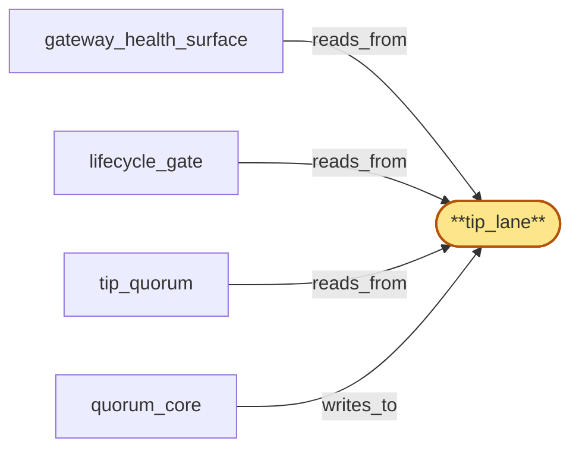

# tip_lane

> Build the tip lane:

## Properties

| Field | Value |
| --- | --- |
| Task | `tip_lane` |
| Scope | `region_coordinator` |
| Node | `tip_lane` |
| Node type | `Log` |
| Dependencies | `0` |
| Wave | `1` |

## Architecture

## Implementation summary

- Build the tip lane: dedicated Raft log for canonical-tip-quorum entries (per chain, fork) with retention class = recent-window only
- consumed by tip_quorum and gateway_health_surface.

## Node definition (`tip_lane` — Log)

- Per-(chain, fork) canonical-tip view, tip-stale set, fork-candidate probationary set, and rollback notifications keyed on chain coordinates.
- High-frequency (one update per chain block per fork).
- Compaction retains only the latest committed tip per (chain, fork) plus a bounded reorg-window history
- older history is dropped at snapshot. Carries HLC stamps and schema_version tags.

## Requirements

### `r1` — SR1-log-retention-classes

**Summary:** Every log entry kind declares an explicit retention class with documented compaction semantics (latest-only, bounded-history, periodic-summary, full-history-with-snapshot); each lane (tombstone, tip, aggregate, control) implements compaction per the kinds it carries.

- Origin: `stressor:1:s-log-unbounded`
- Targets: `tombstone_lane`, `tip_lane`, `aggregate_lane`, `control_lane`
- Matched via: `tip_lane`
- Verifications:
  - Test lanes/tip/retention_class.rs asserts recent-window retention; old entries compacted.

### `r2` — SR1-write-class-lanes

**Summary:** The committed log is partitioned into write-class lanes — tombstone_lane (latency-critical), tip_lane (high-frequency), aggregate_lane (bursty), control_lane (low-frequency) — each with reserved consensus throughput and head-of-line isolation to its own lane.

- Origin: `stressor:1:s-hot-write-contention`
- Targets: `tombstone_lane`, `tip_lane`, `aggregate_lane`, `control_lane`
- Matched via: `tip_lane`
- Verifications:
  - Test lanes/tip/write_class.rs asserts only tip-class writers admitted.

### `r3` — SR1-cross-lane-ordering

**Summary:** Cross-lane causal ordering relevant to consumers (e.g. a revocation that must precede an attestation) is resolved via HLC stamps captured at write time so consumers can reconstruct happens-before across lanes.

- Origin: `stressor:1:s-hot-write-contention`
- Targets: `tombstone_lane`, `tip_lane`, `aggregate_lane`, `control_lane`
- Matched via: `tip_lane`
- Verifications:
  - Test lanes/tip/cross_lane_ordering.rs asserts HLC ordering vs control_lane.

### `r4` — SR1-schema-tagged-entries

**Summary:** Every log entry across all lanes is tagged with the schema_version that produced it; consumers reject entries with schema_version higher than they support.

- Origin: `stressor:1:s-schema-evolution`
- Targets: `tombstone_lane`, `tip_lane`, `aggregate_lane`, `control_lane`
- Matched via: `tip_lane`
- Verifications:
  - Test lanes/tip/schema_tagged.rs asserts entry schema versioning.

## Outputs

| Path | Purpose |
| --- | --- |
| `crates/region_coordinator/src/lanes/tip.rs` | Lane state machine |

## Stack details

- openraft state machine 'tip_lane'; retention class = recent-window (compactable); schema-tagged

## Acceptance criteria

### SR1-log-retention-classes

- Test lanes/tip/retention_class.rs asserts recent-window retention; old entries compacted.

### SR1-write-class-lanes

- Test lanes/tip/write_class.rs asserts only tip-class writers admitted.

### SR1-cross-lane-ordering

- Test lanes/tip/cross_lane_ordering.rs asserts HLC ordering vs control_lane.

### SR1-schema-tagged-entries

- Test lanes/tip/schema_tagged.rs asserts entry schema versioning.

## Related tasks (graph neighbours)

- [gateway_health_surface](gateway_health_surface.md)
- [lifecycle_gate](lifecycle_gate.md)
- [quorum_core](quorum_core.md)
- [tip_quorum](tip_quorum.md)

---

_Source of truth: `archi plan task show tip_lane`. Regenerate with `python3 tasks/_generate.py`._
