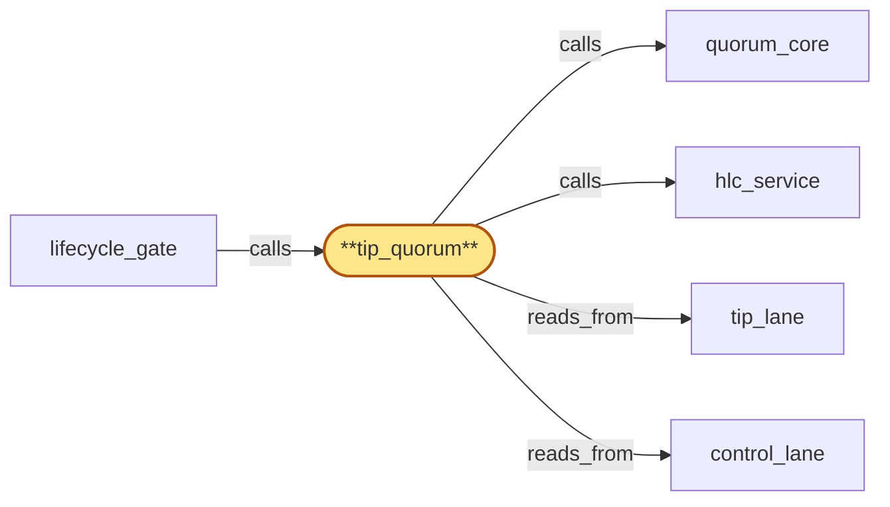

# tip_quorum

> Build the per-fork canonical-tip quorum:

## Properties

| Field | Value |
| --- | --- |
| Task | `tip_quorum` |
| Scope | `region_coordinator` |
| Node | `tip_quorum` |
| Node type | `Subservice` |
| Dependencies | `2` |
| Wave | `3` |

## Architecture

## Implementation summary

- Build the per-fork canonical-tip quorum: aggregates head observations from chain_router replicas (authenticated, rate-limited per source), excludes stale or quarantined sources, derives canonical tip per (chain, fork)
- rollback-coherent
- admission threshold
- probationary timeout.

## Node definition (`tip_quorum` — Subservice)

- Receives head observations from each region's chain_router (parent), authenticated via the cert-bearing surface and tagged with source replica identity.
- Per-source rate limits drop excess submissions and flag the source.
- (chain, fork_id) candidate admission requires N independent observations across N distinct regions (not merely N distinct chain_router replicas in the same region)
- multiple replicas in the same region count once for the threshold so colluding replicas within a region cannot satisfy the threshold alone.
- Below threshold the candidate is held in a probationary set.
- A probationary (chain, fork_id) candidate that exceeds a documented max-probationary-window without reaching the N-region threshold surfaces an alert listing the observed-region-set and the absent-region-set so operators can correlate against ongoing region-drain or rotation events.
- An operator-override admission path exists via lifecycle_gate: tip_quorum does not itself validate operator credentials and does not implement a parallel credential check — it accepts override admissions only when delivered through lifecycle_gate's CAS path, which is the single enforcement point for region_coordinator's operator-credential authorization model (M-of-N signatures from distinct registered operator credentials drawn from the published roster, compromise-revocation invalidates in-flight overrides, per-operator audit trail). tip_quorum's local M-of-N gating semantics over override admission therefore delegate credential validation to lifecycle_gate: it consumes the admitted override entry from tip_lane (or its lifecycle_gate-published precondition record on control_lane), trusts the credential check as having been enforced at admission, and applies the override to the probationary set with the operator-attribution payload preserved end-to-end into subsequent reorg notifications.
- Any override-shaped proposal that did not transit lifecycle_gate's admission contract is rejected.
- Computes the canonical tip per (chain, fork) by quorum across regional chain pools, excluding votes from pools currently in tip-stale state (read from tip_lane and control_lane).
- Detects reorgs and emits coherent rollback notifications keyed on chain coordinates committed via quorum_core into tip_lane.
- Source-quarantine rules include set-level cross-source correlation: a (chain, fork_id) candidate witnessed only by sources in suspicious correlation (synchronized timing, identical observation deltas, no other regional witness) is held probationary even when no single source violates per-source rate, and the correlated set is surfaced in alerts.
- Quarantines surface as alerts and exclude the quarantined source from quorum.
- On partition, minority-region tip_quorum buffers observations under a bounded watermark
- on heal, observations replay with idempotency keys. (Realizes IR-per-fork-canonical-tip, IR-stale-pool-quorum-exclusion, IR-rollback-coherent and the tip-flood derivations
- defers operator-credential validation on override admission to lifecycle_gate per bubble-tip_quorum-1.)

## Requirements

### `r1` — IR-per-fork-canonical-tip

**Summary:** A single canonical-tip view per (chain, fork) is maintained by quorum across regional chain pools and reported as such; tenants subscribe to or query an explicit (chain, fork) pair.

- Origin: `initial`
- Targets: `tip_quorum`
- Matched via: `tip_quorum`
- Verifications:
  - Test tip_quorum/per_fork_canonical_tip.rs asserts canonical tip computed per (chain, fork).

### `r2` — IR-stale-pool-quorum-exclusion

**Summary:** Canonical-tip quorum excludes votes from any chain pool currently in tip-stale state, so a stalled regional pool cannot anchor the global canonical-tip view.

- Origin: `initial`
- Targets: `tip_quorum`
- Matched via: `tip_quorum`
- Verifications:
  - Test tip_quorum/stale_pool_exclusion.rs asserts stale or quarantined sources are excluded from the quorum.

### `r3` — IR-rollback-coherent

**Summary:** Reorg rollback notifications are keyed on globally-meaningful chain coordinates so every region emits a coherent rollback regardless of when its local chain pool observed the reorg.

- Origin: `initial`
- Targets: `tip_quorum`
- Matched via: `tip_quorum`
- Verifications:
  - Test tip_quorum/rollback_coherent.rs asserts canonical-tip transitions are rollback-coherent (no spurious non-monotonic tip jumps).

### `r4` — SR1-tip-source-rate-limit

**Summary:** Per-source rate limit on chain_router head-observation submissions to tip_quorum; observations beyond rate are dropped with a metric and source flagged.

- Origin: `stressor:1:s-tip-observation-flood`
- Targets: `tip_quorum`
- Matched via: `tip_quorum`
- Verifications:
  - Test tip_quorum/source_rate_limit.rs asserts head observations rate-limited per source.

### `r5` — SR1-fork-admission-threshold

**Summary:** A (chain, fork_id) candidate is admitted as a tracked pair only after N independent regional observations across a documented window; below threshold the fork_id is held in a probationary set and not committed to state_log.

- Origin: `stressor:1:s-tip-observation-flood`
- Targets: `tip_quorum`
- Matched via: `tip_quorum`
- Verifications:
  - Test tip_quorum/fork_admission_threshold.rs asserts a new fork is only admitted after threshold of independent observers report it.

### `r6` — SR1-tip-source-quarantine

**Summary:** tip_quorum quarantines chain_router replicas whose observation pattern violates per-source rate or cross-source-correlation rules; quarantines surface as alerts and are visible in the state_log so canonical-tip computation excludes the quarantined source.

- Origin: `stressor:1:s-tip-observation-flood`
- Targets: `tip_quorum`
- Matched via: `tip_quorum`
- Verifications:
  - Test tip_quorum/source_quarantine.rs asserts adversarial sources are quarantined and excluded.

### `r7` — SR2-probationary-timeout

**Summary:** tip_quorum surfaces an alert when a probationary (chain, fork_id) candidate exceeds a documented max-probationary-window without reaching the N-region admission threshold; the alert lists the observed-region-set and the absent-region-set so operators can correlate against ongoing region-drain or rotation events.

- Origin: `stressor:2:probationary-fork-starvation`
- Targets: `tip_quorum`
- Matched via: `tip_quorum`
- Verifications:
  - Test tip_quorum/probationary_timeout.rs asserts a probationary source loses status after timeout.

### `r8` — SR2-region-distinct-admission

**Summary:** tip_quorum's N independent observations for (chain, fork_id) admission must come from N distinct regions, not merely N distinct chain_router replicas; multiple replicas in the same region count once for the threshold so colluding replicas within a region cannot satisfy the threshold alone.

- Origin: `stressor:2:quarantine-collusion-bypass`
- Targets: `tip_quorum`
- Matched via: `tip_quorum`
- Verifications:
  - Test tip_quorum/region_distinct_admission.rs asserts admission requires distinct regions, not just distinct sources within one region.

### `r9` — SR2-set-level-correlation

**Summary:** tip_quorum's source-quarantine rules include set-level cross-source correlation: a (chain, fork_id) candidate witnessed only by sources in suspicious correlation (synchronized timing, identical observation deltas, no other regional witness) is held probationary even when no single source violates per-source rate; the correlated set is surfaced in alerts.

- Origin: `stressor:2:quarantine-collusion-bypass`
- Targets: `tip_quorum`
- Matched via: `tip_quorum`
- Verifications:
  - Test tip_quorum/set_level_correlation.rs asserts correlated divergence across forks raises an alert.

### `r10` — bubble-tip_quorum-1

**Summary:** lifecycle_gate's operator-override admission path needs an operator-credential authorization model with M-of-N signing requirements, credential-rotation, compromise-revocation, and per-operator audit so a single compromised credential cannot issue override admissions; tip_quorum implements local M-of-N gating but parent scope must define and enforce the operator credential model.

- Origin: `freestanding`
- Targets: `tip_quorum`
- Matched via: `tip_quorum`
- Verifications:
  - Test tip_quorum/bubble_tip_quorum_1.rs asserts tip_quorum overrides admit only via region_coordinator's credential roster (M-of-N) per the bubble-1 resolution.

## Outputs

| Path | Purpose |
| --- | --- |
| `crates/region_coordinator/src/tip_quorum.rs` | Tip quorum aggregator |

## Stack details

- Rust module 'region_coordinator::tip_quorum' applying tip_lane entries; per-source rate limit + adversarial-source quarantine
- Region-distinct admission: per-region quorum threshold; set-level correlation tracks correlated divergence across forks

## Acceptance criteria

### IR-per-fork-canonical-tip

- Test tip_quorum/per_fork_canonical_tip.rs asserts canonical tip computed per (chain, fork).

### IR-stale-pool-quorum-exclusion

- Test tip_quorum/stale_pool_exclusion.rs asserts stale or quarantined sources are excluded from the quorum.

### IR-rollback-coherent

- Test tip_quorum/rollback_coherent.rs asserts canonical-tip transitions are rollback-coherent (no spurious non-monotonic tip jumps).

### SR1-tip-source-rate-limit

- Test tip_quorum/source_rate_limit.rs asserts head observations rate-limited per source.

### SR1-fork-admission-threshold

- Test tip_quorum/fork_admission_threshold.rs asserts a new fork is only admitted after threshold of independent observers report it.

### SR1-tip-source-quarantine

- Test tip_quorum/source_quarantine.rs asserts adversarial sources are quarantined and excluded.

### SR2-probationary-timeout

- Test tip_quorum/probationary_timeout.rs asserts a probationary source loses status after timeout.

### SR2-region-distinct-admission

- Test tip_quorum/region_distinct_admission.rs asserts admission requires distinct regions, not just distinct sources within one region.

### SR2-set-level-correlation

- Test tip_quorum/set_level_correlation.rs asserts correlated divergence across forks raises an alert.

### bubble-tip_quorum-1

- Test tip_quorum/bubble_tip_quorum_1.rs asserts tip_quorum overrides admit only via region_coordinator's credential roster (M-of-N) per the bubble-1 resolution.

## Related tasks (graph neighbours)

- [control_lane](control_lane.md)
- [hlc_service](hlc_service.md)
- [lifecycle_gate](lifecycle_gate.md)
- [quorum_core](quorum_core.md)
- [tip_lane](tip_lane.md)

---

_Source of truth: `archi plan task show tip_quorum`. Regenerate with `python3 tasks/_generate.py`._
