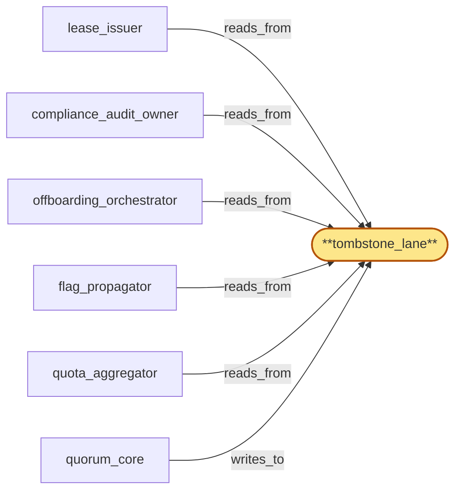

# tombstone_lane

> Build the tombstone lane in the openraft cluster:

## Properties

| Field | Value |
| --- | --- |
| Task | `tombstone_lane` |
| Scope | `region_coordinator` |
| Node | `tombstone_lane` |
| Node type | `Log` |
| Dependencies | `0` |
| Wave | `1` |

## Architecture

## Implementation summary

- Build the tombstone lane in the openraft cluster: dedicated Raft log + state machine for revocation/throttle/erasure/preservation tombstones with explicit retention class, tombstone-history retention, write-class enforcement, lane SLO, cross-lane ordering invariants, and queued-pending classification.

## Node definition (`tombstone_lane` — Log)

- Latency-critical lane for small tombstoned flag entries: throttle, plan-change, cluster-suspended, key-revocation, preservation-hold, erasure-tombstone.
- Also carries queued-pending-component-recovery entries for erasure tombstones whose downstream component is in an open component-outage breaker state (offboarding_orchestrator)
- the queued-pending entries drain via the normal offboarding flow once the breaker closes, and the queue is itself audited and alerted if its depth exceeds a documented bound.
- Reserved consensus throughput with a documented end-to-end commit-latency SLO (the unified fast-path SLO).
- Tombstone history is retained in full through snapshots so revocation semantics survive compaction.
- Entries carry HLC stamps and schema_version tags.

## Requirements

### `r1` — SR1-log-retention-classes

**Summary:** Every log entry kind declares an explicit retention class with documented compaction semantics (latest-only, bounded-history, periodic-summary, full-history-with-snapshot); each lane (tombstone, tip, aggregate, control) implements compaction per the kinds it carries.

- Origin: `stressor:1:s-log-unbounded`
- Targets: `tombstone_lane`, `tip_lane`, `aggregate_lane`, `control_lane`
- Matched via: `tombstone_lane`
- Verifications:
  - Test lanes/tombstone/retention_class.rs asserts retention class = retain-history; old tombstones are not compacted out.

### `r2` — SR1-log-tombstone-history

**Summary:** Tombstone entry kinds (revocation, plan-change, cluster-suspended, preservation-hold, erasure) preserve full ordering history through snapshots so revocation semantics survive compaction and any region's hydration sees the same tombstone state.

- Origin: `stressor:1:s-log-unbounded`
- Targets: `tombstone_lane`
- Matched via: `tombstone_lane`
- Verifications:
  - Test lanes/tombstone/history.rs asserts complete tombstone history retained for replay; no entry is silently dropped.

### `r3` — SR1-write-class-lanes

**Summary:** The committed log is partitioned into write-class lanes — tombstone_lane (latency-critical), tip_lane (high-frequency), aggregate_lane (bursty), control_lane (low-frequency) — each with reserved consensus throughput and head-of-line isolation to its own lane.

- Origin: `stressor:1:s-hot-write-contention`
- Targets: `tombstone_lane`, `tip_lane`, `aggregate_lane`, `control_lane`
- Matched via: `tombstone_lane`
- Verifications:
  - Test lanes/tombstone/write_class.rs asserts entries with mismatched write_class are rejected at admission.

### `r4` — SR1-tombstone-lane-slo

**Summary:** tombstone_lane has a documented per-class SLO upper-bounding end-to-end commit latency for latency-critical flags (revocation, throttle, cluster-suspended, preservation-hold, erasure), monitored independently of bulk throughput.

- Origin: `stressor:1:s-hot-write-contention`
- Targets: `tombstone_lane`
- Matched via: `tombstone_lane`
- Verifications:
  - Test lanes/tombstone/slo.rs asserts apply latency SLO (p99 < documented bound) holds under sustained load.

### `r5` — SR1-cross-lane-ordering

**Summary:** Cross-lane causal ordering relevant to consumers (e.g. a revocation that must precede an attestation) is resolved via HLC stamps captured at write time so consumers can reconstruct happens-before across lanes.

- Origin: `stressor:1:s-hot-write-contention`
- Targets: `tombstone_lane`, `tip_lane`, `aggregate_lane`, `control_lane`
- Matched via: `tombstone_lane`
- Verifications:
  - Test lanes/tombstone/cross_lane_ordering.rs asserts cross-lane HLC ordering invariants hold against control_lane and aggregate_lane.

### `r6` — SR1-schema-tagged-entries

**Summary:** Every log entry across all lanes is tagged with the schema_version that produced it; consumers reject entries with schema_version higher than they support.

- Origin: `stressor:1:s-schema-evolution`
- Targets: `tombstone_lane`, `tip_lane`, `aggregate_lane`, `control_lane`
- Matched via: `tombstone_lane`
- Verifications:
  - Test lanes/tombstone/schema_tagged.rs asserts every entry has entry_schema_version honored at apply.

### `r7` — SR2-queued-pending-class

**Summary:** tombstone_lane recognizes a queued-pending-component-recovery entry kind for erasure tombstones whose downstream component is in an open component-outage breaker state; the queue drains via normal offboarding flow once the breaker closes; the queue is itself audited and alerted if depth exceeds a documented bound.

- Origin: `stressor:2:best-effort-cascade`
- Targets: `tombstone_lane`
- Matched via: `tombstone_lane`
- Verifications:
  - Test lanes/tombstone/queued_pending_class.rs asserts queued-pending is a documented entry class with explicit terminal transition.

## Outputs

| Path | Purpose |
| --- | --- |
| `crates/region_coordinator/src/lanes/tombstone.rs` | Lane state machine + apply |

## Stack details

- openraft state machine 'tombstone_lane' implementing AppendEntries -> apply on a per-lane log; retention policy = retain-history (no compaction past tombstone)
- Schema-tagged entries: every entry carries entry_schema_version, write_class, hlc; rejected if write_class doesn't match this lane

## Acceptance criteria

### SR1-log-retention-classes

- Test lanes/tombstone/retention_class.rs asserts retention class = retain-history; old tombstones are not compacted out.

### SR1-log-tombstone-history

- Test lanes/tombstone/history.rs asserts complete tombstone history retained for replay; no entry is silently dropped.

### SR1-write-class-lanes

- Test lanes/tombstone/write_class.rs asserts entries with mismatched write_class are rejected at admission.

### SR1-tombstone-lane-slo

- Test lanes/tombstone/slo.rs asserts apply latency SLO (p99 < documented bound) holds under sustained load.

### SR1-cross-lane-ordering

- Test lanes/tombstone/cross_lane_ordering.rs asserts cross-lane HLC ordering invariants hold against control_lane and aggregate_lane.

### SR1-schema-tagged-entries

- Test lanes/tombstone/schema_tagged.rs asserts every entry has entry_schema_version honored at apply.

### SR2-queued-pending-class

- Test lanes/tombstone/queued_pending_class.rs asserts queued-pending is a documented entry class with explicit terminal transition.

## Related tasks (graph neighbours)

- [compliance_audit_owner](compliance_audit_owner.md)
- [flag_propagator](flag_propagator.md)
- [lease_issuer](lease_issuer.md)
- [offboarding_orchestrator](offboarding_orchestrator.md)
- [quorum_core](quorum_core.md)
- [quota_aggregator](quota_aggregator.md)

---

_Source of truth: `archi plan task show tombstone_lane`. Regenerate with `python3 tasks/_generate.py`._
