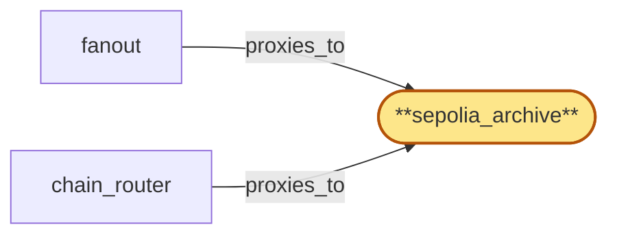

# sepolia_archive

> Provision the Sepolia testnet archive ChainPool:

## Properties

| Field | Value |
| --- | --- |
| Task | `sepolia_archive` |
| Scope | `/` |
| Node | `sepolia_archive` |
| Node type | `ChainPool` |
| Dependencies | `0` |
| Wave | `1` |

## Architecture

## Implementation summary

- Provision the Sepolia testnet archive ChainPool: same shape as eth_archive at smaller scale
- Erigon archive StatefulSet with mTLS sidecar and tip-lag liveness probe.

## Node definition (`sepolia_archive` — ChainPool)

- Sepolia testnet chain-node pool: a managed group of replicas mirroring the Ethereum pool's role split (archive + pruned tip), serving Sepolia's RPC and chain-sync interfaces
- chain_router and fanout select replicas from the pool.
- Replicas declare their (chain_id, fork_id) allegiance so chain_router partitions the pool by fork sub-pool.
- Replicas support an explicit drain state under chain_router's pool-drain protocol.
- Each replica reports tip-lag against chain peer count / expected slot advance for tip-staleness detection. mTLS surface to chain_router and fanout is enumerated in cert-inventory

## Requirements

### `r1` — R-sepolia

**Summary:** System exposes Sepolia testnet on-chain data (current and historical) to authenticated clients via the chain's native JSON-RPC interface

- Origin: `initial`
- Targets: `sepolia_archive`
- Matched via: `sepolia_archive`
- Verifications:
  - Integration test in tests/chain-pools/sepolia_archive_e2e.rs asserts the Sepolia Erigon pool returns a recent block and a historical sentinel block via JSON-RPC, and Envoy rejects non-mTLS callers.

## Outputs

| Path | Purpose |
| --- | --- |
| `charts/chain-pools/sepolia-archive/` | Helm chart for Sepolia Erigon archive + sidecar |
| `ops/runbooks/sepolia-archive.md` | Operator runbook for Sepolia replica lifecycle |

## Stack details

- Helm chart 'charts/chain-pools/sepolia-archive' (Erigon archive image, smaller resource profile)
- Same Envoy mTLS + SPIRE pattern as eth_archive

## Acceptance criteria

### R-sepolia

- Integration test in tests/chain-pools/sepolia_archive_e2e.rs asserts the Sepolia Erigon pool returns a recent block and a historical sentinel block via JSON-RPC, and Envoy rejects non-mTLS callers.

## Related tasks (graph neighbours)

- [chain_router_integration](chain_router/README.md)
- [fanout](fanout.md)

---

_Source of truth: `archi plan task show sepolia_archive`. Regenerate with `python3 tasks/_generate.py`._
