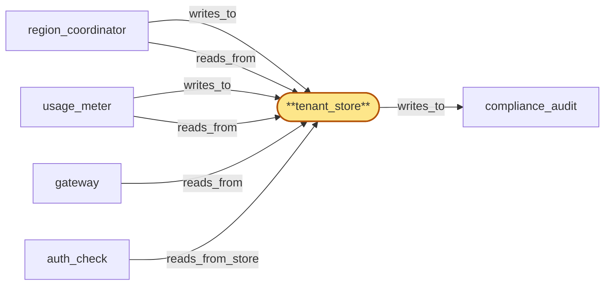
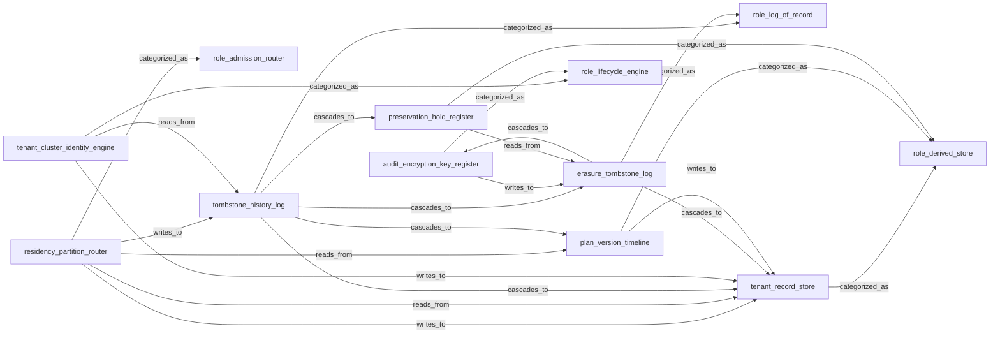

# tenant_store_integration

> Integrate the 12 tenant_store child tasks into a single deployable per-region Postgres-backed tenant store:

## Properties

| Field | Value |
| --- | --- |
| Task | `tenant_store_integration` |
| Scope | `/` |
| Node | `tenant_store` |
| Node type | `Store` |
| Dependencies | `12` |
| Wave | `4` |

## Architecture

## Implementation summary

- Integrate the 12 tenant_store child tasks into a single deployable per-region Postgres-backed tenant store: tenant_record_store + plan_version_timeline + preservation_hold_register + audit_encryption_key_register stores wired through residency_partition_router and tombstone_history_log + erasure_tombstone_log
- tenant_cluster_identity_engine
- SubsystemRole categorizations
- Helm chart for the Postgres + sqlx app.

## Node definition (`tenant_store` — Store)

- Canonical multi-region store of tenants, API keys, plan tiers, tenant_cluster identity, residency policy, preservation holds, erasure tombstones, and rate-limit / quota state.
- Partitioned by tenant residency policy (residency-scoped, not globally replicated for residency-pinned tenants).
- Concurrent writes resolve under PER-TENANT SINGLE-WRITER LEASE: every write under a lease presents (record_version, lease_id) and tenant_store enforces UNIFORM CAS-ON-(RECORD_VERSION, LEASE_ID) — a write whose lease_id is strictly older than the most recent lease_id observed for the same tenant key is rejected, regardless of the writer's TTL.
- The CAS rule is uniform across tenant_store sub-nodes (per-residency partition or per-key shard cannot diverge).
- Lease-handoff is fenced: tenant_store records the HLC-stamped handoff event from region_coordinator's lease_issuer as a typed handoff-fence record before acking the handoff back to lease_issuer, so a TTL-valid old-lease write submitted after the fence is rejected with 'lease-superseded' (a third deny class distinct from 'lease-stale' and 'residency-miss').
- External read paths (auth_cache hydration, usage_meter cost attribution) read the (record_version, lease_id) tuple as canonical.
- Tombstoned revocations: any region observes regardless of replication direction (not subject to last-write-wins).
- Plan-change events are stored and propagated as globally-ordered tombstones with effective-from timestamp.
- Tenant_cluster identity groups tenants by signup metadata, source-network fingerprints, behavioral signals, and query-pattern similarity.
- Preservation orders are tombstoned hold records keyed on (tenant, data_class, scope, time_range)
- held data is exempt from retention rotation
- preservation-erasure conflicts resolve under preservation-wins.
- Tenant erasure requests are durable tombstones that propagate cross-region.
- ERASURE FLOW: tenant_store consumes lifecycle_gate-broadcast drain-fences, collects drain-of-in-flight-audit-writes-for-T acks from every named writer (region_coordinator, chain_router, gateway, fanout, address_index, usage_meter) into the per-tenant erasure record
- retries unacked drain-fence delivery with documented exponential backoff up to a per-tenant retry budget bounded by the HLC offboarding window
- on retry-budget exhaustion finalizes in one of two enumerated modes selected per-jurisdiction by residency policy — STRICT (refuse-attestation
- lifecycle_gate emits 'erasure-incomplete' to compliance_audit
- operator-driven remediation required) or PARTIAL-WITH-WITNESSES (witness records — broadcast-emit attestation from lifecycle_gate plus in-region observer ack from another writer that observed the missing writer reachable at broadcast-emit-time — and the certificate is typed partial-with-witnesses, machine-distinguishable from full-ack)
- best-effort-without-witnesses is not a permitted finalization mode. tenant_store assembles the per-store erasure attestations + drain-ack receipts under the tenant erasure tombstone and writes the assembled certificate-of-deletion entry to compliance_audit
- lifecycle_gate's audit-key DESTROYED event closes the assembly.
- RESIDENCY POLICY 2PC: tenant_store is the PREPARE-phase participant for residency_publisher's policy_version transition — quarantine-and-relocate-complete is acked to region_coordinator before activation
- tenant_store enters V+1-prepared on receipt of the prepare and waits for an HLC-bounded prepared-window for the commit-or-abort decision.
- On window expiry without decision, tenant_store enters PREPARED-ORPHAN degraded mode: alarms region_coordinator's lifecycle_gate, refuses further V+1 prepares, writes a typed entry to compliance_audit, and is visible on operator dashboards
- recovery requires explicit operator action under M-of-N (re-broadcast activation to commit, or trigger rollback to abort)
- no silent self-resolution. Relocate-and-rollback is idempotent on (tenant_key, V+1, attempt_id): same abort_id twice is a no-op
- strictly newer attempt_id starts a fresh relocate from V's current state, never from a half-rolled-back state
- in-flight writes admitted under V+1-prepared that never observed commit are quarantined to a typed 'prepared-orphan-write' state and re-classified only under explicit operator decision.
- Once a tenant is offboarded and its erasure attestation is final, that tenant identity cannot be resurrected.
- Supports 'extract for tenant T' returning only T's data, scoped to residency policy.
- Each region holds the partitions it is allowed to host.
- Internal channels to gateway, usage_meter, region_coordinator are cert-bearing surfaces enumerated in cert-inventory
- tenant_store writes erasure attestations and certificate-of-deletion entries to compliance_audit on its own append-only RPC surface

## Requirements

### `r1` — R-tenant-store-replication

**Summary:** tenant_store state is replicated across regions with bounded lag; each region can authenticate and rate-limit using local replicas

- Origin: `stressor:1:S-region-outage`
- Targets: `tenant_store`
- Matched via: `tenant_store`
- Verifications:
  - Test ts_int/replication.rs asserts cross-region logical replication propagates writes within bounded HLC; no write loss across replica failover.

### `r2` — R-tenant-store-conflict-resolution

**Summary:** Concurrent writes to tenant_store across regions resolve under an explicit, documented conflict-resolution policy (CRDT, partition by tenant home region, or write quorum) so that no key revocation can be 'un-revoked' by a conflicting concurrent write

- Origin: `stressor:2:S-tenant-store-split-brain`
- Targets: `tenant_store`
- Matched via: `tenant_store`
- Verifications:
  - Test ts_int/conflict_resolution.rs asserts CAS-on-(record_version, lease_id) returns three distinct deny classes (lease-stale, lease-superseded, residency-miss) under concurrent writers.

### `r3` — R-revocation-tombstone

**Summary:** Key and tenant revocations are stored as tombstones with global ordering so any region's auth_cache hydration sees a revocation regardless of replication lag direction

- Origin: `stressor:2:S-tenant-store-split-brain`
- Targets: `tenant_store`
- Matched via: `tenant_store`
- Verifications:
  - Test ts_int/revocation_tombstone.rs asserts revocations land as tombstones with idempotency keys; replay does not duplicate cascades.

### `r4` — R-residency-policy

**Summary:** Each tenant has an explicit residency policy that constrains the regions in which their tenant data, traffic, and derived telemetry may live; the system enforces this policy at the edge, in tenant_store partitioning, and in metrics_store / usage_meter sharding

- Origin: `stressor:2:S-data-residency`
- Targets: `tenant_store`
- Matched via: `tenant_store`
- Verifications:
  - Test ts_int/residency_policy.rs asserts every read/write checks the active policy_version; sticky deny-by-default on missed ack of a tightening change.

### `r5` — R-plan-tombstone

**Summary:** Plan-change events (upgrade, downgrade, suspension) are stored and propagated as globally-ordered tombstones with an effective-from timestamp so any region's auth_cache and tenant_store hydration sees a consistent view of which plan is in force at any point in time, regardless of replication lag direction.

- Origin: `stressor:3:s3-plan-downgrade-race`
- Targets: `tenant_store`
- Matched via: `tenant_store`
- Verifications:
  - Test ts_int/plan_tombstone.rs asserts plan-supersede tombstones are recorded; superseded plan_versions are not surfaced by rebuild.

### `r6` — R-tenant-cluster-identity

**Summary:** The system models a tenant_cluster identity that groups tenants by signup metadata, source-network fingerprints, behavioral signals, and query-pattern similarity. Every tenant carries a current cluster id; cluster assignment evolves as more behavioral signal accrues.

- Origin: `stressor:3:s3-signup-farm-abuse`
- Targets: `tenant_store`
- Matched via: `tenant_store`
- Verifications:
  - Test ts_int/cluster_identity.rs asserts compute_cluster_id is deterministic and observable across regions.

### `r7` — R-cluster-suspension

**Summary:** Cluster-level suspensions (driven by abuse signal) are tombstoned and globally ordered like key revocations, propagate to every region's auth_cache via the same fast-path, and reject all member tenants' new requests with a documented 'cluster-suspended' rejection reason.

- Origin: `stressor:3:s3-signup-farm-abuse`
- Targets: `tenant_store`
- Matched via: `tenant_store`
- Verifications:
  - Test ts_int/cluster_suspension.rs asserts cluster suspension propagates to gateway via auth_cache cluster-flag fast-path.

### `r8` — R-data-subject-extract

**Summary:** Every store holding tenant-attributable data (tenant_store, usage_meter, metrics_store, address_index, auth_cache hydration log) supports a documented 'extract for tenant T' operation returning only T's data, scoped to the residency policy in force, suitable for fulfilling a lawful-access or data-subject-access request without disclosing other tenants.

- Origin: `stressor:3:s3-lawful-access`
- Targets: `tenant_store`
- Matched via: `tenant_store`
- Verifications:
  - Test ts_int/data_subject_extract.rs asserts DSAR returns a complete bundle when all partitions reachable; complete-or-nothing on any failure.

### `r9` — R-preservation-hold

**Summary:** Preservation orders are recorded as tombstoned hold records keyed on (tenant, data_class, scope, time_range); held data is exempt from retention rotation. Holds are globally ordered and propagate cross-region. While a hold is in force, erasure of overlapping data is denied with a documented reason.

- Origin: `stressor:3:s3-lawful-access`
- Targets: `tenant_store`
- Matched via: `tenant_store`
- Verifications:
  - Test ts_int/preservation_hold.rs asserts an active hold blocks erasure cascades until released.

### `r10` — R-erasure-tombstone

**Summary:** Tenant erasure requests are durable tombstones that propagate cross-region like revocations. Each store produces a verifiable per-store deletion attestation; the aggregate certificate of deletion is auditable. Erasure-preservation conflicts resolve under a documented preservation-wins policy.

- Origin: `stressor:3:s3-lawful-access`
- Targets: `tenant_store`
- Matched via: `tenant_store`
- Verifications:
  - Test ts_int/erasure_tombstone.rs asserts erasure cascades are idempotent and observe preservation-wins protocol.

### `r11` — R-no-tenant-resurrection

**Summary:** Once a tenant is offboarded and the erasure attestation is final, that tenant identity cannot be resurrected. Restoring service to the same human/organization requires a new tenant identity. Attempts to reuse an offboarded tenant id are rejected with a documented reason.

- Origin: `stressor:3:s3-tenant-offboarding-orphan`
- Targets: `tenant_store`
- Matched via: `tenant_store`
- Verifications:
  - Test ts_int/no_resurrection.rs asserts re-onboarding under a tenant_id with an existing erasure tombstone is rejected with a documented error class.

### `r12` — bubble-tenant_store-1

**Summary:** region_coordinator MUST issue per-tenant single-writer lease tokens with HLC-bounded TTL to tenant_store, with explicit lease handoff semantics across intra-region failover so that on partition heal at most one writer holds a valid lease for a given tenant; lease issuance, renewal, revocation, and HLC-bounded TTL bound become a parent-scope contract on region_coordinator.

- Origin: `freestanding`
- Targets: `tenant_store`
- Matched via: `tenant_store`
- Verifications:
  - Test ts_int/bubble_tenant_store_1.rs asserts bubble-1 invariant: drain-fence-broadcast-and-ack protocol is consumed by tenant_store before erasure.

### `r13` — bubble-tenant_store-2

**Summary:** Tenant-erasure introduces a system-wide drain-fence-broadcast-and-ack protocol: every operational write plane that ever writes audit entries for a tenant (region_coordinator, chain_router, gateway, fanout, address_index, usage_meter) MUST ack drain-of-in-flight-audit-writes-for-tenant-T to tenant_store within an HLC-bounded window; the ack-or-block contract is a parent-scope concern because tenant_store cannot finalize erasure attestation or destroy audit-encryption-keys without acks from those nodes.

- Origin: `freestanding`
- Targets: `tenant_store`
- Matched via: `tenant_store`
- Verifications:
  - Test ts_int/bubble_tenant_store_2.rs asserts bubble-2 invariant: composite certificate-of-deletion assembly logic per spec.

### `r14` — bubble-tenant_store-3

**Summary:** Residency policy_version transition becomes a two-phase commit at the parent scope: region_coordinator MUST receive a quarantine-and-relocate-complete ack from tenant_store before activating policy_version V+1 region-wide; without this ack, V-tagged writes that landed in a partition no longer permitted under V+1 remain in-flight in violation of the residency policy.

- Origin: `freestanding`
- Targets: `tenant_store`
- Matched via: `tenant_store`
- Verifications:
  - Test ts_int/bubble_tenant_store_3.rs asserts bubble-3 invariant: residency 2PC PREPARE depends on tenant_store quarantine-and-relocate-complete ack.

### `r15` — bubble-tenant_store-4

**Summary:** compliance_audit at root must record drain-ack receipts and audit-key destruction events as part of the certificate of deletion, so the certificate is a verifiable composite of (per-store erasure attestations + drain-ack receipts + audit-key DESTROYED log entry).

- Origin: `freestanding`
- Targets: `tenant_store`
- Matched via: `tenant_store`
- Verifications:
  - Test ts_int/bubble_tenant_store_4.rs asserts bubble-4 invariant: PREPARED-ORPHAN degraded mode on window expiry; abort idempotency on (tenant_key, V+1, attempt_id).

### `r16` — r-s5-lease-cas-uniform

**Summary:** tenant_store enforces uniform CAS-on-(record_version, lease_id) for every write under per-tenant single-writer lease: writes present (record_version, lease_id) and tenant_store rejects any write whose lease_id is strictly older than the most recent lease_id observed for the same tenant key, regardless of the writer's TTL. The check is uniform across tenant_store sub-nodes (so per-residency partition or per-key shard cannot diverge in CAS ordering); external read paths (auth_cache hydration, usage_meter cost attribution) read the (record_version, lease_id) tuple as the canonical record state so reader-side observability inherits the writer-side fence.

- Origin: `stressor:5:s5-lease-handoff-cas-race`
- Targets: `tenant_store`
- Matched via: `tenant_store`
- Verifications:
  - Test ts_int/lease_cas_uniform.rs asserts every writer uses the same CAS-on-(record_version, lease_id) contract; no writer paths bypass.

### `r17` — r-s5-composite-cert-retry-policy

**Summary:** tenant_store retries unacked drain-fence delivery with documented exponential backoff up to a per-tenant retry budget bounded by the HLC offboarding window. On retry-budget exhaustion the certificate-of-deletion finalizes in one of two enumerated modes selected per-jurisdiction by residency policy: STRICT (refuse-attestation; lifecycle_gate emits a typed 'erasure-incomplete' event to compliance_audit naming the missing writer; operator must drive remediation before re-attempt) or PARTIAL-WITH-WITNESSES (certificate finalizes with explicit witness records — broadcast-emit attestation from lifecycle_gate plus in-region observer ack from another writer that observed the missing writer reachable at broadcast-emit-time — and is typed as partial-with-witnesses, machine-distinguishable from full-ack). Best-effort-without-witnesses is not a permitted finalization mode.

- Origin: `stressor:5:s5-composite-cert-partial-ack-loss`
- Targets: `tenant_store`
- Matched via: `tenant_store`
- Verifications:
  - Test ts_int/composite_cert_retry_policy.rs asserts retry policy for composite-cert assembly does not double-write attestations.

### `r18` — r-s5-residency-2pc-prepared-orphan

**Summary:** tenant_store's V+1-prepared state has an HLC-bounded prepared-window. If no commit-or-abort decision is observed within the window, tenant_store enters a 'prepared-orphan' degraded mode that alarms region_coordinator's lifecycle_gate, refuses further V+1 prepares, writes a typed entry to compliance_audit, and is visible on operator dashboards. Recovery requires explicit operator action under M-of-N operator-credential authorization (re-broadcast activation to commit, or trigger rollback to abort); silent self-resolution is not permitted.

- Origin: `stressor:5:s5-policy-2pc-stuck-prepared`
- Targets: `tenant_store`
- Matched via: `tenant_store`
- Verifications:
  - Test ts_int/residency_2pc_prepared_orphan.rs asserts on window expiry tenant_store enters PREPARED-ORPHAN documented degraded mode and surfaces the metric.

### `r19` — r-s5-residency-2pc-abort-idempotency

**Summary:** Residency policy_version V+1 abort is an M-of-regions quorum-witnessed CAS event with monotonic abort_id per (V+1) attempt; tenant_store's relocate-and-rollback is idempotent on (tenant_key, V+1, attempt_id): receiving the same abort_id twice is a no-op; receiving a strictly newer attempt_id starts a fresh relocate from V's current state, never from a half-rolled-back state. In-flight writes admitted under V+1-prepared that never observed commit are quarantined to a typed 'prepared-orphan-write' state on tenant_store and re-classified only under explicit operator decision, never silently. Each abort writes a typed entry to compliance_audit.

- Origin: `stressor:5:s5-policy-2pc-abort-rollback`
- Targets: `tenant_store`
- Matched via: `tenant_store`
- Verifications:
  - Test ts_int/residency_2pc_abort_idempotency.rs asserts abort is idempotent on (tenant_key, V+1, attempt_id).

## Outputs

| Path | Purpose |
| --- | --- |
| `charts/stores/tenant-store/` | Helm chart for tenant_store Postgres |
| `crates/tenant_store/tests/integration/` | End-to-end integration tests |

## Stack details

- Helm chart 'charts/stores/tenant-store' deploying per-region Postgres with logical replication; Rust crate 'crates/tenant_store' as a library consumed by region_coordinator and gateway
- End-to-end integration tests in 'crates/tenant_store/tests/integration/' covering replication, residency partitioning, lease CAS, erasure cascades

## Acceptance criteria

### R-tenant-store-replication

- Test ts_int/replication.rs asserts cross-region logical replication propagates writes within bounded HLC; no write loss across replica failover.

### R-tenant-store-conflict-resolution

- Test ts_int/conflict_resolution.rs asserts CAS-on-(record_version, lease_id) returns three distinct deny classes (lease-stale, lease-superseded, residency-miss) under concurrent writers.

### R-revocation-tombstone

- Test ts_int/revocation_tombstone.rs asserts revocations land as tombstones with idempotency keys; replay does not duplicate cascades.

### R-residency-policy

- Test ts_int/residency_policy.rs asserts every read/write checks the active policy_version; sticky deny-by-default on missed ack of a tightening change.

### R-plan-tombstone

- Test ts_int/plan_tombstone.rs asserts plan-supersede tombstones are recorded; superseded plan_versions are not surfaced by rebuild.

### R-tenant-cluster-identity

- Test ts_int/cluster_identity.rs asserts compute_cluster_id is deterministic and observable across regions.

### R-cluster-suspension

- Test ts_int/cluster_suspension.rs asserts cluster suspension propagates to gateway via auth_cache cluster-flag fast-path.

### R-data-subject-extract

- Test ts_int/data_subject_extract.rs asserts DSAR returns a complete bundle when all partitions reachable; complete-or-nothing on any failure.

### R-preservation-hold

- Test ts_int/preservation_hold.rs asserts an active hold blocks erasure cascades until released.

### R-erasure-tombstone

- Test ts_int/erasure_tombstone.rs asserts erasure cascades are idempotent and observe preservation-wins protocol.

### R-no-tenant-resurrection

- Test ts_int/no_resurrection.rs asserts re-onboarding under a tenant_id with an existing erasure tombstone is rejected with a documented error class.

### bubble-tenant_store-1

- Test ts_int/bubble_tenant_store_1.rs asserts bubble-1 invariant: drain-fence-broadcast-and-ack protocol is consumed by tenant_store before erasure.

### bubble-tenant_store-2

- Test ts_int/bubble_tenant_store_2.rs asserts bubble-2 invariant: composite certificate-of-deletion assembly logic per spec.

### bubble-tenant_store-3

- Test ts_int/bubble_tenant_store_3.rs asserts bubble-3 invariant: residency 2PC PREPARE depends on tenant_store quarantine-and-relocate-complete ack.

### bubble-tenant_store-4

- Test ts_int/bubble_tenant_store_4.rs asserts bubble-4 invariant: PREPARED-ORPHAN degraded mode on window expiry; abort idempotency on (tenant_key, V+1, attempt_id).

### r-s5-lease-cas-uniform

- Test ts_int/lease_cas_uniform.rs asserts every writer uses the same CAS-on-(record_version, lease_id) contract; no writer paths bypass.

### r-s5-composite-cert-retry-policy

- Test ts_int/composite_cert_retry_policy.rs asserts retry policy for composite-cert assembly does not double-write attestations.

### r-s5-residency-2pc-prepared-orphan

- Test ts_int/residency_2pc_prepared_orphan.rs asserts on window expiry tenant_store enters PREPARED-ORPHAN documented degraded mode and surfaces the metric.

### r-s5-residency-2pc-abort-idempotency

- Test ts_int/residency_2pc_abort_idempotency.rs asserts abort is idempotent on (tenant_key, V+1, attempt_id).

## Related tasks (graph neighbours)

- [compliance_audit_integration](compliance_audit/README.md)
- [gateway_integration](gateway/README.md)
- [region_coordinator_integration](region_coordinator/README.md)
- [usage_meter](usage_meter.md)

---

_Source of truth: `archi plan task show tenant_store_integration`. Regenerate with `python3 tasks/_generate.py`._

## Child tasks

| Task | Wave | Deps | Brief |
| --- | --- | --- | --- |
| [audit_encryption_key_register](audit_encryption_key_register.md) | 1 | 0 | Build the per-tenant audit-encryption-key register: tracks lifecycle phases (ACTIVE, SUPERSEDED, DESTROYING, DESTROYED) with two-phase cl... |
| [erasure_tombstone_log](erasure_tombstone_log.md) | 2 | 3 | Build the erasure-tombstone log: append-only Postgres log of erasure tombstones per (tenant, scope) with cascade pointers; cascades to te... |
| [plan_version_timeline](plan_version_timeline.md) | 1 | 0 | Build the per-tenant plan-version timeline (Postgres append-only): records each plan-change as a row carrying plan_version, effective_at_... |
| [preservation_hold_register](preservation_hold_register.md) | 1 | 0 | Build the per-tenant preservation-hold register: legal/compliance hold marker that blocks erasure cascades on the tenant until the hold e... |
| [residency_partition_router](residency_partition_router.md) | 2 | 2 | Build the residency partition router: gates every read/write against the active residency policy_version; pins policy_version on write; s... |
| [role_admission_router](role_admission_router.md) | 1 | 0 | Document the 'role_admission_router' subsystem-role categorization: a categorization label (no implementation work) recording which tenan... |
| [role_derived_store](role_derived_store.md) | 1 | 0 | Document the 'role_derived_store' subsystem-role categorization: a categorization label (no implementation work) recording which tenant_s... |
| [role_lifecycle_engine](role_lifecycle_engine.md) | 1 | 0 | Document the 'role_lifecycle_engine' subsystem-role categorization: a categorization label (no implementation work) recording which tenan... |
| [role_log_of_record](role_log_of_record.md) | 1 | 0 | Document the 'role_log_of_record' subsystem-role categorization: a categorization label (no implementation work) recording which tenant_s... |
| [tenant_cluster_identity_engine](tenant_cluster_identity_engine.md) | 2 | 1 | Build the tenant_cluster identity engine: computes deterministic tenant_cluster identity from tenant + plan + residency facts; supports c... |
| [tenant_record_store](tenant_record_store.md) | 1 | 0 | Build the canonical Postgres-backed tenant record table: per-(tenant, key) row with record_version + lease_id columns enabling CAS-on-(re... |
| [tombstone_history_log](tombstone_history_log.md) | 3 | 4 | Build the master tombstone history log: append-only Postgres log of every tombstone (revocation, plan-supersede, preservation-hold-expiry... |

## Internal architecture

