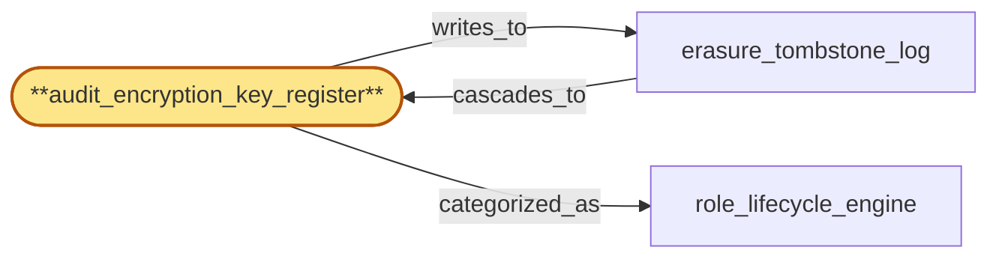

# audit_encryption_key_register

> Build the per-tenant audit-encryption-key register:

## Properties

| Field | Value |
| --- | --- |
| Task | `audit_encryption_key_register` |
| Scope | `tenant_store` |
| Node | `audit_encryption_key_register` |
| Node type | `Register` |
| Dependencies | `0` |
| Wave | `1` |

## Architecture

## Implementation summary

- Build the per-tenant audit-encryption-key register: tracks lifecycle phases (ACTIVE, SUPERSEDED, DESTROYING, DESTROYED) with two-phase clock-skew-bounded fence on destruction
- supports rotation overlap windows.

## Node definition (`audit_encryption_key_register` — Register)

- Per-tenant audit-encryption-key lifecycle register holding (tenant_id, key_id, status: ISSUED|ROTATED|DESTROYED, hlc, generation). Issuance on tenant onboarding
- scheduled rotation is a two-phase transition with explicit overlap window: (a) new key ISSUED, both new and old accepted for in-flight
- (b) HLC-bounded grace, old transitioned to ROTATED, new is sole writer
- (c) only after grace expires is old eligible for DESTROYED.
- Irreversible destruction-on-erasure (crypto-shred) is cascaded from erasure_tombstone_log under the four-phase destruction protocol: only after all operational write planes ack drain of in-flight audit writes for the tenant, and strictly before the per-store erasure attestation is finalized
- destruction is itself logged and signed. All audit chain entries record (tenant, key_id, generation) so verifiers can resolve which key was in force at each HLC.

## Requirements

### `r1` — R-audit-key-lifecycle

**Summary:** Per-tenant audit-encryption-keys have an explicit lifecycle (issuance on onboarding, scheduled rotation, irreversible destruction-on-erasure) and key destruction must occur after any in-flight audit writes drain and before per-store erasure attestation is finalized so compliance_audit crypto-shred is enforceable.

- Origin: `initial`
- Targets: `audit_encryption_key_register`
- Matched via: `audit_encryption_key_register`
- Verifications:
  - Unit test on the phase state machine: every illegal transition is rejected; legal transitions advance phase atomically; lifecycle invariants enforced (cannot DESTROY without SUPERSEDE).

### `r2` — R-ts-audit-key-four-phase-destruction

**Summary:** erasure_tombstone_log drives a four-phase destruction protocol against audit_encryption_key_register: (1) erasure committed; (2) drain fence broadcast and ackd by every operational write plane; (3) audit_encryption_key_register transitions to DESTROYED only after all drain-acks; (4) per-store erasure attestation finalized only after key destruction logged. Missing drain-ack blocks destruction with documented reason.

- Origin: `stressor:1:ts-audit-key-destruction-ordering`
- Targets: `audit_encryption_key_register`
- Matched via: `audit_encryption_key_register`
- Verifications:
  - Integration test asserting two-phase destruction: DESTROYING→DESTROYED is blocked until fence_end_hlc has passed (clock-skew bound) AND erasure_tombstone_log reports no pending cascades; on success, late audit-writes are rejected by compliance_audit at admission.

### `r3` — R-ts-key-rotation-overlap

**Summary:** audit_encryption_key_register rotation is two-phase with explicit overlap window: (a) new key ISSUED, both new and old accepted for in-flight; (b) HLC-bounded grace, old transitioned to ROTATED, new is sole writer; (c) only after grace expires is old eligible for DESTROYED. Audit chain entries record (tenant, key_id, generation) so verifiers can resolve which key was in force at each HLC.

- Origin: `stressor:1:ts-key-rotation-during-read`
- Targets: `audit_encryption_key_register`
- Matched via: `audit_encryption_key_register`
- Verifications:
  - Integration test asserting rotation overlap: at all times during a rotation, at least one ACTIVE key exists for the tenant; encrypting writes never observe a zero-key window.

## Outputs

| Path | Purpose |
| --- | --- |
| `crates/tenant_store/migrations/0004_audit_key.sql` | Migration creating audit_key table + phase enum |
| `crates/tenant_store/src/audit_key.rs` | Rust state machine with phase guards |

## Stack details

- Postgres table 'tenants.audit_key' (tenant_id, key_id PK, phase enum, created_at_hlc, supersedes_key_id nullable, destroyed_fence_start_hlc nullable, destroyed_fence_end_hlc nullable)
- Rust state machine guards transitions: ACTIVE→SUPERSEDED requires a successor key, SUPERSEDED→DESTROYING starts the fence, DESTROYING→DESTROYED only after fence_end_hlc passes and erasure_tombstone_log confirms no pending cascades; rotation overlap = (ACTIVE keys per tenant >= 1 always)

## Acceptance criteria

### R-audit-key-lifecycle

- Unit test on the phase state machine: every illegal transition is rejected; legal transitions advance phase atomically; lifecycle invariants enforced (cannot DESTROY without SUPERSEDE).

### R-ts-audit-key-four-phase-destruction

- Integration test asserting two-phase destruction: DESTROYING→DESTROYED is blocked until fence_end_hlc has passed (clock-skew bound) AND erasure_tombstone_log reports no pending cascades; on success, late audit-writes are rejected by compliance_audit at admission.

### R-ts-key-rotation-overlap

- Integration test asserting rotation overlap: at all times during a rotation, at least one ACTIVE key exists for the tenant; encrypting writes never observe a zero-key window.

## Related tasks (graph neighbours)

- [erasure_tombstone_log](erasure_tombstone_log.md)
- [role_lifecycle_engine](role_lifecycle_engine.md)

---

_Source of truth: `archi plan task show audit_encryption_key_register`. Regenerate with `python3 tasks/_generate.py`._
