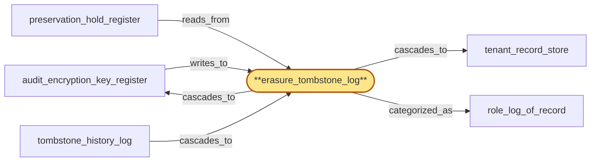

# erasure_tombstone_log

> Build the erasure-tombstone log:

## Properties

| Field | Value |
| --- | --- |
| Task | `erasure_tombstone_log` |
| Scope | `tenant_store` |
| Node | `erasure_tombstone_log` |
| Node type | `Log` |
| Dependencies | `3` |
| Wave | `2` |

## Architecture

## Implementation summary

- Build the erasure-tombstone log: append-only Postgres log of erasure tombstones per (tenant, scope) with cascade pointers
- cascades to tenant_record_store + audit_encryption_key_register
- respects preservation holds
- enforces no-resurrection.

## Node definition (`erasure_tombstone_log` — Log)

- Committed-erasure tombstone log: durable per-tenant erasure tombstones with their offboarding attestations, the canonical owner of the append-only no-resurrection blacklist of offboarded tenant ids, and the aggregated certificate of deletion.
- MUST consult preservation_hold_register before committing any erasure and is rejected with documented preservation-wins reason if any active hold intersects.
- Drives a four-phase destruction protocol against audit_encryption_key_register: (1) erasure committed to log
- (2) drain fence broadcast — every operational write plane (region_coordinator, chain_router, gateway, fanout, address_index, usage_meter) must ack drain-of-in-flight-audit-writes-for-tenant-T
- (3) audit_encryption_key_register transitions key to DESTROYED only after all drain-acks observed within an HLC-bounded window
- (4) per-store erasure attestation is finalized only after key destruction is logged. Missing drain-ack blocks destruction (and thus attestation finalization) with documented reason.

## Requirements

### `r1` — R-erasure-tombstone

**Summary:** Tenant erasure requests are durable tombstones that propagate cross-region like revocations. Each store produces a verifiable per-store deletion attestation; the aggregate certificate of deletion is auditable. Erasure-preservation conflicts resolve under a documented preservation-wins policy.

- Origin: `initial`
- Targets: `erasure_tombstone_log`
- Matched via: `erasure_tombstone_log`
- Verifications:
  - Integration test asserting a cascade idempotently performs (tenant_record_store delete, audit_encryption_key_register key destruction) exactly once even under retry; cascade_status transitions monotonically.

### `r2` — R-no-tenant-resurrection

**Summary:** Once a tenant is offboarded and the erasure attestation is final, that tenant identity cannot be resurrected. Restoring service to the same human/organization requires a new tenant identity. Attempts to reuse an offboarded tenant id are rejected with a documented reason.

- Origin: `initial`
- Targets: `erasure_tombstone_log`
- Matched via: `erasure_tombstone_log`
- Verifications:
  - Integration test asserting a tenant for whom an erasure tombstone exists cannot be re-onboarded under the same tenant_id (no-resurrection); a re-onboard attempt fails with a documented error code.

### `r3` — R-ts-preservation-wins-protocol

**Summary:** all preservation_hold and erasure cascades flow through tombstone_history_log with deterministic per-(tenant, data_class) ordering: when preservation_hold and erasure_tombstone for overlapping scope are within the same HLC tick, preservation_hold is ordered first; erasure_tombstone_log MUST consult preservation_hold_register before committing and reject with documented reason on intersect.

- Origin: `stressor:1:ts-preservation-vs-erasure-race`
- Targets: `erasure_tombstone_log`
- Matched via: `erasure_tombstone_log`
- Verifications:
  - Integration test asserting preservation-wins protocol: when a hold is asserted concurrently with an erasure tombstone, the cascade is blocked and the tombstone records blocked_by_hold_id; on hold release, cascade resumes idempotently.

## Outputs

| Path | Purpose |
| --- | --- |
| `crates/tenant_store/migrations/0005_erasure_tombstone.sql` | Migration creating erasure_tombstone log |
| `crates/tenant_store/src/erasure_tombstone.rs` | Rust API with cascade orchestration |

## Stack details

- Postgres table 'tenants.erasure_tombstone' (tombstone_id PK, tenant_id, scope, asserted_at_hlc, blocked_by_hold_id nullable, cascade_status, idempotency_key)
- Rust API: assert_erasure(tenant_id, scope, idempotency_key) consults preservation_hold_register first; cascade_to_record_store + cascade_to_audit_key are idempotent on cascade_status; blocked_by_hold_id pins to the hold that paused the cascade
- REVOKE UPDATE/DELETE on the log; only INSERT and SELECT permitted to app role

## Acceptance criteria

### R-erasure-tombstone

- Integration test asserting a cascade idempotently performs (tenant_record_store delete, audit_encryption_key_register key destruction) exactly once even under retry; cascade_status transitions monotonically.

### R-no-tenant-resurrection

- Integration test asserting a tenant for whom an erasure tombstone exists cannot be re-onboarded under the same tenant_id (no-resurrection); a re-onboard attempt fails with a documented error code.

### R-ts-preservation-wins-protocol

- Integration test asserting preservation-wins protocol: when a hold is asserted concurrently with an erasure tombstone, the cascade is blocked and the tombstone records blocked_by_hold_id; on hold release, cascade resumes idempotently.

## Related tasks (graph neighbours)

- [audit_encryption_key_register](audit_encryption_key_register.md)
- [preservation_hold_register](preservation_hold_register.md)
- [role_log_of_record](role_log_of_record.md)
- [tenant_record_store](tenant_record_store.md)
- [tombstone_history_log](tombstone_history_log.md)

---

_Source of truth: `archi plan task show erasure_tombstone_log`. Regenerate with `python3 tasks/_generate.py`._
