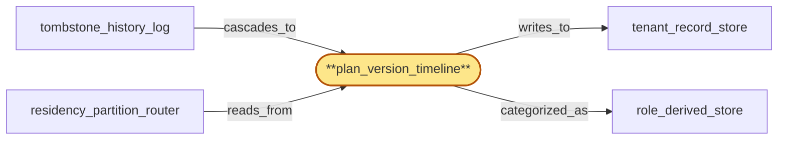

# plan_version_timeline

> Build the per-tenant plan-version timeline (Postgres append-only):

## Properties

| Field | Value |
| --- | --- |
| Task | `plan_version_timeline` |
| Scope | `tenant_store` |
| Node | `plan_version_timeline` |
| Node type | `Store` |
| Dependencies | `0` |
| Wave | `1` |

## Architecture

## Implementation summary

- Build the per-tenant plan-version timeline (Postgres append-only): records each plan-change as a row carrying plan_version, effective_at_hlc, and a tombstone marker
- enables degraded-mode rebuild from the log of record.

## Node definition (`plan_version_timeline` — Store)

- Versioned per-tenant plan/quota timeline holding the ordered list of (plan_version, effective_from_hlc, originator_id) entries
- supports point-in-time queries (what plan was in force at hlc T?) and rebuild from tombstone_history_log replay.
- While a rebuild is in progress, returns a documented rebuilding-from-log status to readers (gateway, usage_meter), not an empty view
- readers fall back to a documented degraded-mode (last-known plan from auth_cache hydration) rather than no-plan
- rebuild streams replay from tombstone_history_log starting at the most recent durable plan-checkpoint and only flips back to serving once replay catches up to live HLC.

## Requirements

### `r1` — R-plan-tombstone

**Summary:** Plan-change events (upgrade, downgrade, suspension) are stored and propagated as globally-ordered tombstones with an effective-from timestamp so any region auth_cache and tenant_store hydration sees a consistent view of which plan is in force at any point in time, regardless of replication lag direction.

- Origin: `initial`
- Targets: `plan_version_timeline`
- Matched via: `plan_version_timeline`
- Verifications:
  - Integration test: insert a plan change with tombstone_kind='superseded' for an old plan_version; assert rebuild_active_plan does not surface the tombstoned plan even though the row remains.

### `r2` — R-ts-plan-rebuild-degraded-mode

**Summary:** while plan_version_timeline is rebuilding from tombstone_history_log replay, readers receive a documented rebuilding-from-log status (not empty); readers fall back to a documented degraded-mode using last-known plan from auth_cache hydration; rebuild flips back to serving only after replay catches up to live HLC.

- Origin: `stressor:1:ts-plan-timeline-rebuild`
- Targets: `plan_version_timeline`
- Matched via: `plan_version_timeline`
- Verifications:
  - Integration test asserting that with tenant_record_store snapshot truncated, rebuild_active_plan(tenant_id) reconstructs the active plan by replaying plan_timeline rows in HLC order — the log of record IS the source of truth.

## Outputs

| Path | Purpose |
| --- | --- |
| `crates/tenant_store/migrations/0002_plan_timeline.sql` | Migration creating plan_timeline table + REVOKE UPDATE/DELETE |
| `crates/tenant_store/src/plan_timeline.rs` | Rust module with insert_plan_change + rebuild_active_plan |

## Stack details

- Postgres table 'tenants.plan_timeline' (tenant_id, plan_version, effective_at_hlc, tombstone_kind, body JSONB, PK (tenant_id, plan_version))
- Append-only enforced by REVOKE UPDATE/DELETE on the table for app role; Rust API insert_plan_change(tenant_id, plan_version, ...) and rebuild_active_plan(tenant_id)

## Acceptance criteria

### R-plan-tombstone

- Integration test: insert a plan change with tombstone_kind='superseded' for an old plan_version; assert rebuild_active_plan does not surface the tombstoned plan even though the row remains.

### R-ts-plan-rebuild-degraded-mode

- Integration test asserting that with tenant_record_store snapshot truncated, rebuild_active_plan(tenant_id) reconstructs the active plan by replaying plan_timeline rows in HLC order — the log of record IS the source of truth.

## Related tasks (graph neighbours)

- [residency_partition_router](residency_partition_router.md)
- [role_derived_store](role_derived_store.md)
- [tenant_record_store](tenant_record_store.md)
- [tombstone_history_log](tombstone_history_log.md)

---

_Source of truth: `archi plan task show plan_version_timeline`. Regenerate with `python3 tasks/_generate.py`._
