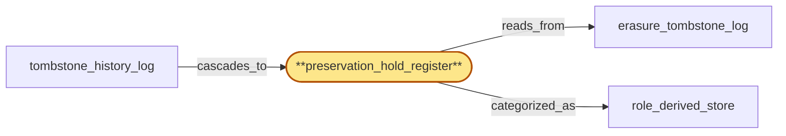

# preservation_hold_register

> Build the per-tenant preservation-hold register:

## Properties

| Field | Value |
| --- | --- |
| Task | `preservation_hold_register` |
| Scope | `tenant_store` |
| Node | `preservation_hold_register` |
| Node type | `Register` |
| Dependencies | `0` |
| Wave | `1` |

## Architecture

## Implementation summary

- Build the per-tenant preservation-hold register: legal/compliance hold marker that blocks erasure cascades on the tenant until the hold expires or is explicitly released
- expiry generates a tombstone.

## Node definition (`preservation_hold_register` — Register)

- Active preservation-hold register keyed on (tenant_id, data_class, scope, time_range, hold_id) recording each active hold with provenance (issuing authority, hlc, custodial reason)
- held data is exempt from retention rotation
- erasure of overlapping data is denied while a hold intersects.
- Evaluates hold-active under an hlc-as-of policy: an incoming erasure cascade carries an admission_hlc and the hold is treated as active iff its time_range encompasses admission_hlc with a documented grace-window appended
- expiry is itself a tombstone written to tombstone_history_log so observers see a consistent expiry hlc.

## Requirements

### `r1` — R-preservation-hold

**Summary:** Preservation orders are recorded as tombstoned hold records keyed on (tenant, data_class, scope, time_range); held data is exempt from retention rotation. Holds are globally ordered and propagate cross-region. While a hold is in force, erasure of overlapping data is denied with a documented reason.

- Origin: `initial`
- Targets: `preservation_hold_register`
- Matched via: `preservation_hold_register`
- Verifications:
  - Integration test: assert a hold blocks an erasure cascade attempted against the tenant (preservation_blocked terminal state surfaced), and lifting the hold unblocks the cascade.

### `r2` — R-ts-hold-expiry-tombstone

**Summary:** preservation_hold_register evaluates hold-active under hlc-as-of: an incoming erasure carries an admission_hlc and a hold is active iff its time_range encompasses admission_hlc plus documented grace; expiry is itself a tombstone written to tombstone_history_log so observers see a consistent expiry hlc.

- Origin: `stressor:1:ts-preservation-hold-expiry`
- Targets: `preservation_hold_register`
- Matched via: `preservation_hold_register`
- Verifications:
  - Integration test asserting that on hold expiry, the engine emits a per-(tenant, hold_id) tombstone into erasure_tombstone_log and unblocks any pending cascades.

## Outputs

| Path | Purpose |
| --- | --- |
| `crates/tenant_store/migrations/0003_preservation_hold.sql` | Migration creating preservation_hold table |
| `crates/tenant_store/src/preservation_hold.rs` | Rust module with hold lifecycle API |

## Stack details

- Postgres table 'tenants.preservation_hold' (tenant_id, hold_id PK, kind, asserted_at_hlc, expires_at_hlc, released_at_hlc nullable, asserter_identity)
- Rust API: assert_hold, release_hold, list_active_holds(tenant_id), is_blocked_for_erasure(tenant_id) — last consulted by erasure_tombstone_log before cascading

## Acceptance criteria

### R-preservation-hold

- Integration test: assert a hold blocks an erasure cascade attempted against the tenant (preservation_blocked terminal state surfaced), and lifting the hold unblocks the cascade.

### R-ts-hold-expiry-tombstone

- Integration test asserting that on hold expiry, the engine emits a per-(tenant, hold_id) tombstone into erasure_tombstone_log and unblocks any pending cascades.

## Related tasks (graph neighbours)

- [erasure_tombstone_log](erasure_tombstone_log.md)
- [role_derived_store](role_derived_store.md)
- [tombstone_history_log](tombstone_history_log.md)

---

_Source of truth: `archi plan task show preservation_hold_register`. Regenerate with `python3 tasks/_generate.py`._
