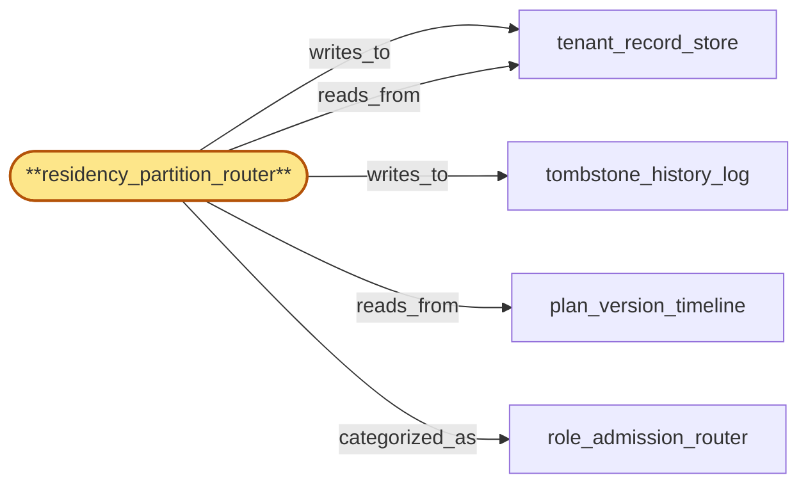

# residency_partition_router

> Build the residency partition router:

## Properties

| Field | Value |
| --- | --- |
| Task | `residency_partition_router` |
| Scope | `tenant_store` |
| Node | `residency_partition_router` |
| Node type | `Router` |
| Dependencies | `2` |
| Wave | `2` |

## Architecture

## Implementation summary

- Build the residency partition router: gates every read/write against the active residency policy_version
- pins policy_version on write
- sticky deny-by-default on missed ack of a tightening change
- DSAR (data-subject extraction) is complete-or-nothing.

## Node definition (`residency_partition_router` — Router)

- Stateful router that resolves any incoming write or read to its residency partition by consulting the in-force policy_version pinned by region_coordinator.
- Treats its policy_version as a sticky deny-by-default cache: reads served against a stale policy_version are blocked with a stale-policy reason rather than returning data
- refreshes policy_version via push-and-acknowledge from region_coordinator and short-circuits to deny while a refresh is in flight. Stamps every accepted write with the policy_version observed at admission
- in-flight writes admitted under V continue to commit under V
- reconciliation of any V-tagged write that landed in a partition no longer permitted under V+1 is a synchronous quarantine-and-relocate step before the policy_version transition is acknowledged to region_coordinator.
- Gates every onboarding write to tenant_record_store by consulting erasure_tombstone_log first
- an onboarding write whose tenant_id appears in the offboarded-id blacklist is rejected at the router with a documented no-resurrection reason and never reaches tenant_record_store.
- DSAR-extract is a complete-or-nothing operation: if any of (tenant_record_store, plan_version_timeline, preservation_hold_register, erasure_tombstone_log) cannot answer scoped to residency within an HLC-bounded freshness window, returns extract-unavailable with the named unavailable sub-node
- partial extracts are forbidden
- the response includes a per-sub-node freshness block.

## Requirements

### `r1` — R-residency-policy

**Summary:** Each tenant has an explicit residency policy that constrains the regions in which their tenant data, traffic, and derived telemetry may live; the system enforces this policy at the edge, in tenant_store partitioning, and in metrics_store / usage_meter sharding

- Origin: `initial`
- Targets: `residency_partition_router`
- Matched via: `residency_partition_router`
- Verifications:
  - Integration test asserting a write tagged with policy_version V is partitioned to the residency-allowed partition for V; a write tagged with V-1 after V is active is denied with reason=stale-policy.

### `r2` — R-data-subject-extract

**Summary:** tenant_store supports a documented extract for tenant T operation returning only T data, scoped to the residency policy in force, suitable for fulfilling a lawful-access or DSAR request without disclosing other tenants.

- Origin: `initial`
- Targets: `residency_partition_router`
- Matched via: `residency_partition_router`
- Verifications:
  - Integration test asserting DSAR returns a complete bundle when all partitions reachable, and Result::Incomplete (no partial bundle delivered) when any partition is unreachable; assert no bytes leak to caller in the Incomplete branch.

### `r3` — R-ts-write-policy-version-tag

**Summary:** residency_partition_router stamps every accepted write with the policy_version observed at admission; in-flight writes admitted under V continue to commit under V; reconciliation of any V-tagged write that landed in a partition no longer permitted under V+1 is a synchronous quarantine-and-relocate before the policy_version transition is acked to region_coordinator.

- Origin: `stressor:1:ts-residency-router-policy-skew`
- Targets: `residency_partition_router`
- Matched via: `residency_partition_router`
- Verifications:
  - Unit test asserting every committed write carries the active policy_version tag in its body.

### `r4` — R-ts-dsar-complete-or-nothing

**Summary:** residency_partition_router DSAR-extract is complete-or-nothing: if any of (tenant_record_store, plan_version_timeline, preservation_hold_register, erasure_tombstone_log) cannot answer scoped to residency within an HLC-bounded freshness window, returns extract-unavailable with the named unavailable sub-node; partial extracts are forbidden; response includes a per-sub-node freshness block.

- Origin: `stressor:1:ts-dsar-extract-partial-availability`
- Targets: `residency_partition_router`
- Matched via: `residency_partition_router`
- Verifications:
  - Integration test asserting DSAR is atomic: simulate failure mid-extract; bundle is not partially returned; counter for incomplete-extracts increments.

### `r5` — R-ts-blacklist-gate

**Summary:** erasure_tombstone_log is the canonical owner of the offboarded-id blacklist; residency_partition_router gates every onboarding write to tenant_record_store by consulting erasure_tombstone_log first; an onboarding write whose tenant_id appears in the blacklist is rejected at the router with documented reason and never reaches tenant_record_store.

- Origin: `stressor:1:ts-no-resurrection-blacklist-owner`
- Targets: `residency_partition_router`
- Matched via: `residency_partition_router`
- Verifications:
  - Integration test asserting a blacklisted tenant_id is rejected before partition routing — even with valid policy_version.

### `r6` — R-ts-router-sticky-deny

**Summary:** residency_partition_router treats its policy_version as a sticky deny-by-default cache: reads served against a stale policy_version are blocked with a stale-policy reason rather than returning data; the router refreshes via push-and-acknowledge from region_coordinator and short-circuits to deny while refresh is in flight.

- Origin: `stressor:1:ts-residency-router-stale-read`
- Targets: `residency_partition_router`
- Matched via: `residency_partition_router`
- Verifications:
  - Integration test asserting Sticky-Deny: simulate a missed-ack on a tightening change; subsequent reads/writes return Sticky-Deny(version) until the router ack-readies a strictly newer version.

## Outputs

| Path | Purpose |
| --- | --- |
| `crates/tenant_store/src/residency_router.rs` | Router trait + DSAR worker + sticky-deny state machine |
| `crates/tenant_store/src/blacklist.rs` | Blacklist gate consulted on every routing call |

## Stack details

- Rust trait Router with route_write(tenant_id, body, policy_version) -> RoutingDecision::{Allow(partition), Deny(reason), Sticky-Deny(version)}
- Active policy_version pulled from region_coordinator's residency_publisher push channel; Router subscribes and acks readiness within the documented window; on miss, transitions to Sticky-Deny for that version
- DSAR worker: extract_data_subject(tenant_id) reads from every residency-allowed partition, returns Result<Bundle, Incomplete> — on partial failure, no bundle is delivered (complete-or-nothing)
- Blacklist gate: residency policy can deny a tenant_id outright; gate is checked before partition routing

## Acceptance criteria

### R-residency-policy

- Integration test asserting a write tagged with policy_version V is partitioned to the residency-allowed partition for V; a write tagged with V-1 after V is active is denied with reason=stale-policy.

### R-data-subject-extract

- Integration test asserting DSAR returns a complete bundle when all partitions reachable, and Result::Incomplete (no partial bundle delivered) when any partition is unreachable; assert no bytes leak to caller in the Incomplete branch.

### R-ts-write-policy-version-tag

- Unit test asserting every committed write carries the active policy_version tag in its body.

### R-ts-dsar-complete-or-nothing

- Integration test asserting DSAR is atomic: simulate failure mid-extract; bundle is not partially returned; counter for incomplete-extracts increments.

### R-ts-blacklist-gate

- Integration test asserting a blacklisted tenant_id is rejected before partition routing — even with valid policy_version.

### R-ts-router-sticky-deny

- Integration test asserting Sticky-Deny: simulate a missed-ack on a tightening change; subsequent reads/writes return Sticky-Deny(version) until the router ack-readies a strictly newer version.

## Related tasks (graph neighbours)

- [plan_version_timeline](plan_version_timeline.md)
- [role_admission_router](role_admission_router.md)
- [tenant_record_store](tenant_record_store.md)
- [tombstone_history_log](tombstone_history_log.md)

---

_Source of truth: `archi plan task show residency_partition_router`. Regenerate with `python3 tasks/_generate.py`._
