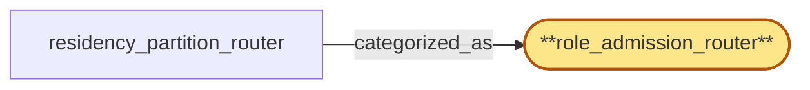

# role_admission_router

> Document the 'role_admission_router' subsystem-role categorization:

## Properties

| Field | Value |
| --- | --- |
| Task | `role_admission_router` |
| Scope | `tenant_store` |
| Node | `role_admission_router` |
| Node type | `SubsystemRole` |
| Dependencies | `0` |
| Wave | `1` |

## Architecture

## Implementation summary

- Document the 'role_admission_router' subsystem-role categorization: a categorization label (no implementation work) recording which tenant_store subsystem plays this role.
- Verified by code-link to the categorized_as edges.

## Node definition (`role_admission_router` — SubsystemRole)

- Subsystem role: stateful router that resolves admission decisions (residency, blacklist, freshness) before any write reaches a downstream sub-node.

## Outputs

| Path | Purpose |
| --- | --- |
| `docs/architecture/tenant_store/role_admission_router.md` | Markdown doc enumerating which tenant_store subsystems are categorized_as role_admission_router and why |

## Stack details

- No code artifact: categorization label only. Resolved at architecture-doc time, not at runtime.

## Related tasks (graph neighbours)

- [residency_partition_router](residency_partition_router.md)

---

_Source of truth: `archi plan task show role_admission_router`. Regenerate with `python3 tasks/_generate.py`._
