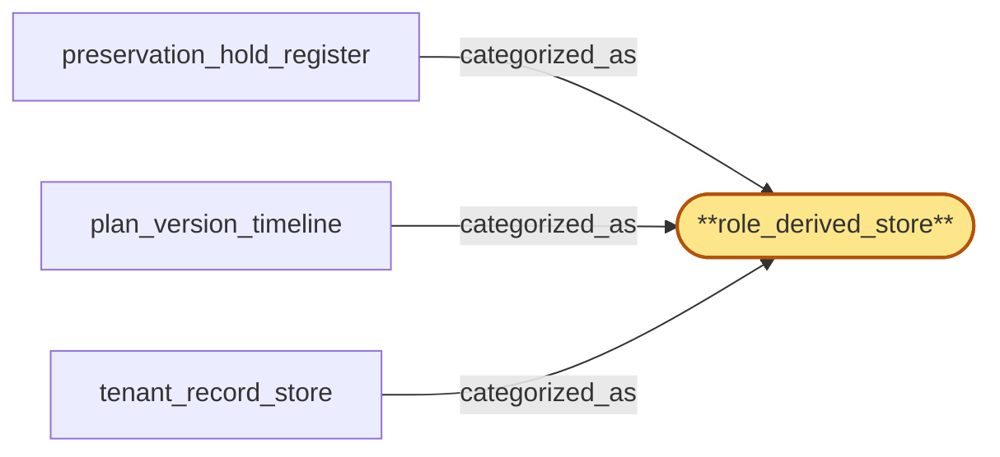

# role_derived_store

> Document the 'role_derived_store' subsystem-role categorization:

## Properties

| Field | Value |
| --- | --- |
| Task | `role_derived_store` |
| Scope | `tenant_store` |
| Node | `role_derived_store` |
| Node type | `SubsystemRole` |
| Dependencies | `0` |
| Wave | `1` |

## Architecture

## Implementation summary

- Document the 'role_derived_store' subsystem-role categorization: a categorization label (no implementation work) recording which tenant_store subsystem plays this role. Verified by code-link to the categorized_as edges.

## Node definition (`role_derived_store` — SubsystemRole)

- Subsystem role: durable store whose state is fully derivable from log replay
- serves point-in-time queries
- rebuildable from the log of record.

## Outputs

| Path | Purpose |
| --- | --- |
| `docs/architecture/tenant_store/role_derived_store.md` | Markdown doc enumerating which tenant_store subsystems are categorized_as role_derived_store and why |

## Stack details

- No code artifact: categorization label only. Resolved at architecture-doc time, not at runtime.

## Related tasks (graph neighbours)

- [plan_version_timeline](plan_version_timeline.md)
- [preservation_hold_register](preservation_hold_register.md)
- [tenant_record_store](tenant_record_store.md)

---

_Source of truth: `archi plan task show role_derived_store`. Regenerate with `python3 tasks/_generate.py`._
