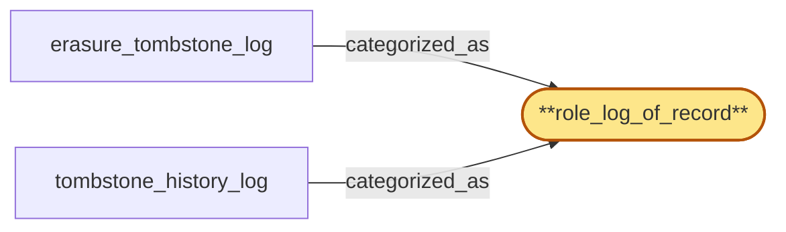

# role_log_of_record

> Document the 'role_log_of_record' subsystem-role categorization:

## Properties

| Field | Value |
| --- | --- |
| Task | `role_log_of_record` |
| Scope | `tenant_store` |
| Node | `role_log_of_record` |
| Node type | `SubsystemRole` |
| Dependencies | `0` |
| Wave | `1` |

## Architecture

## Implementation summary

- Document the 'role_log_of_record' subsystem-role categorization: a categorization label (no implementation work) recording which tenant_store subsystem plays this role. Verified by code-link to the categorized_as edges.

## Node definition (`role_log_of_record` — SubsystemRole)

- Subsystem role: append-only globally-ordered log that is the canonical source of truth for tombstoned events
- downstream sub-nodes derive their state from replay of this log.

## Outputs

| Path | Purpose |
| --- | --- |
| `docs/architecture/tenant_store/role_log_of_record.md` | Markdown doc enumerating which tenant_store subsystems are categorized_as role_log_of_record and why |

## Stack details

- No code artifact: categorization label only. Resolved at architecture-doc time, not at runtime.

## Related tasks (graph neighbours)

- [erasure_tombstone_log](erasure_tombstone_log.md)
- [tombstone_history_log](tombstone_history_log.md)

---

_Source of truth: `archi plan task show role_log_of_record`. Regenerate with `python3 tasks/_generate.py`._
