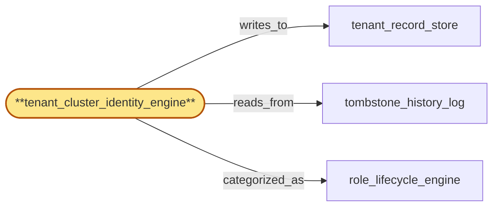

# tenant_cluster_identity_engine

> Build the tenant_cluster identity engine:

## Properties

| Field | Value |
| --- | --- |
| Task | `tenant_cluster_identity_engine` |
| Scope | `tenant_store` |
| Node | `tenant_cluster_identity_engine` |
| Node type | `Engine` |
| Dependencies | `1` |
| Wave | `2` |

## Architecture

## Implementation summary

- Build the tenant_cluster identity engine: computes deterministic tenant_cluster identity from tenant + plan + residency facts
- supports cluster suspension as an idempotent decision with version checkpoints.

## Node definition (`tenant_cluster_identity_engine` — Engine)

- Tenant-to-cluster identity resolver: holds (tenant_id -> current cluster_id) mapping with strictly-monotonic cluster_assignment_version per tenant
- consumes cluster-level flags (suspension, abuse) and republishes per-tenant effective-cluster state to tenant_record_store.
- Answers is-T-suspended deterministically by resolving T cluster id at the read HLC and checking tombstone_history_log for cluster suspensions on that cluster_id with HLC <= read HLC
- cross-cluster cascades that arrive out of order are reordered by HLC at consumption time. Durably checkpoints (tenant_id, cluster_assignment_version) before publishing to tenant_record_store
- on restart, replay-from-checkpoint never re-issues a published version
- refuses to advance past the durable checkpoint without confirmed publication
- repeated crashloops bounded-retry the same version rather than emitting a new one.

## Requirements

### `r1` — R-tenant-cluster-identity

**Summary:** The system models a tenant_cluster identity that groups tenants by signup metadata, source-network fingerprints, behavioral signals, and query-pattern similarity. Every tenant carries a current cluster id; cluster assignment evolves as more behavioral signal accrues.

- Origin: `initial`
- Targets: `tenant_cluster_identity_engine`
- Matched via: `tenant_cluster_identity_engine`
- Verifications:
  - Property test asserting compute_cluster_id is a pure function: same inputs yield same cluster_id across runs and across regions.

### `r2` — R-cluster-suspension

**Summary:** Cluster-level suspensions (driven by abuse signal) are tombstoned and globally ordered like key revocations, propagate to every region auth_cache via the same fast-path, and reject all member tenants new requests with a documented cluster-suspended rejection reason.

- Origin: `initial`
- Targets: `tenant_cluster_identity_engine`
- Matched via: `tenant_cluster_identity_engine`
- Verifications:
  - Integration test asserting suspension propagates: a suspended cluster is observable to gateway via auth_cache cluster-flag fast-path within bounded HLC delay.

### `r3` — R-ts-cluster-deterministic-suspension

**Summary:** tenant_cluster_identity_engine assigns a strictly-monotonic cluster_assignment_version per tenant and answers is-T-suspended deterministically by resolving cluster id at the read HLC and checking tombstone_history_log for cluster suspensions with HLC <= read HLC; reordering by HLC at consumption time guarantees determinism independent of arrival order.

- Origin: `stressor:1:ts-cluster-reassignment-inflight`
- Targets: `tenant_cluster_identity_engine`
- Matched via: `tenant_cluster_identity_engine`
- Verifications:
  - Determinism test: running the suspension decision twice on identical inputs yields the same outcome and same cluster_version checkpoint.

### `r4` — R-ts-cluster-version-checkpoint

**Summary:** tenant_cluster_identity_engine durably checkpoints (tenant_id, cluster_assignment_version) before publishing to tenant_record_store; on restart, replay-from-checkpoint never re-issues a published version; cluster_assignment_version generation is monotonic-per-tenant and the engine refuses to advance past the durable checkpoint without confirmed publication.

- Origin: `stressor:1:ts-cluster-engine-crashloop`
- Targets: `tenant_cluster_identity_engine`
- Matched via: `tenant_cluster_identity_engine`
- Verifications:
  - Integration test asserting cluster_version checkpoint advances on every suspension change and is queryable for read-after-write semantics.

## Outputs

| Path | Purpose |
| --- | --- |
| `crates/tenant_store/migrations/0007_cluster.sql` | Migrations: tenants.cluster_identity, tenants.cluster_suspension |
| `crates/tenant_store/src/cluster.rs` | compute_cluster_id + suspension API |

## Stack details

- Pure Rust function compute_cluster_id(tenant_id, plan_version, residency_region) returning a stable cluster_id (BLAKE3-hashed namespace), recorded in tenants.cluster_identity table
- Suspension: write to tenants.cluster_suspension(cluster_id, suspended_at_hlc, reason); deterministic — same inputs always yield same suspension decision; checkpointed cluster_version per suspension generation

## Acceptance criteria

### R-tenant-cluster-identity

- Property test asserting compute_cluster_id is a pure function: same inputs yield same cluster_id across runs and across regions.

### R-cluster-suspension

- Integration test asserting suspension propagates: a suspended cluster is observable to gateway via auth_cache cluster-flag fast-path within bounded HLC delay.

### R-ts-cluster-deterministic-suspension

- Determinism test: running the suspension decision twice on identical inputs yields the same outcome and same cluster_version checkpoint.

### R-ts-cluster-version-checkpoint

- Integration test asserting cluster_version checkpoint advances on every suspension change and is queryable for read-after-write semantics.

## Related tasks (graph neighbours)

- [role_lifecycle_engine](role_lifecycle_engine.md)
- [tenant_record_store](tenant_record_store.md)
- [tombstone_history_log](tombstone_history_log.md)

---

_Source of truth: `archi plan task show tenant_cluster_identity_engine`. Regenerate with `python3 tasks/_generate.py`._
