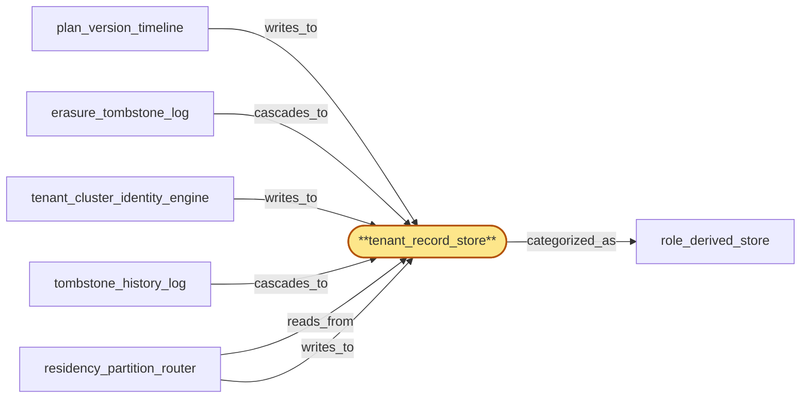

# tenant_record_store

> Build the canonical Postgres-backed tenant record table:

## Properties

| Field | Value |
| --- | --- |
| Task | `tenant_record_store` |
| Scope | `tenant_store` |
| Node | `tenant_record_store` |
| Node type | `Store` |
| Dependencies | `0` |
| Wave | `1` |

## Architecture

## Implementation summary

- Build the canonical Postgres-backed tenant record table: per-(tenant, key) row with record_version + lease_id columns enabling CAS-on-(record_version, lease_id) writes
- logical replication for cross-region read replicas
- per-tenant residency-region partitioning.

## Node definition (`tenant_record_store` — Store)

- Durable per-tenant master record holding the canonical (tenant_id, current plan, current status, current cluster id, residency policy id, home region, current api keys snapshot ref) tuple, multi-region replicated with bounded lag.
- Single-writer-per-tenant enforced via region_coordinator-issued lease tokens with HLC-bounded TTL: intra-region failover requires the standby to acquire a fresh lease (which the original primary cannot hold across a partition)
- writes without a current lease are rejected
- on partition heal, only one side has a valid lease and the other side reconciles its local writes through tombstone_history_log replay. Authoritative read for gateway/usage_meter authentication and rate-limit hydration.

## Requirements

### `r1` — R-tenant-store-replication

**Summary:** tenant_store state is replicated across regions with bounded lag; each region can authenticate and rate-limit using local replicas

- Origin: `initial`
- Targets: `tenant_record_store`
- Matched via: `tenant_record_store`
- Verifications:
  - Integration test in crates/tenant_store/tests/replication.rs spins up two regions via testcontainers Postgres + logical replication and asserts a write to region-A tenants.record propagates to region-B's read replica within bounded HLC delay; assert no write loss across replica failover.

### `r2` — R-tenant-store-conflict-resolution

**Summary:** Concurrent writes to tenant_store across regions resolve under an explicit, documented conflict-resolution policy (CRDT, partition by tenant home region, or write quorum) so that no key revocation can be un-revoked by a conflicting concurrent write

- Origin: `initial`
- Targets: `tenant_record_store`
- Matched via: `tenant_record_store`
- Verifications:
  - Unit test on write_with_lease asserting all three deny classes (lease-stale, lease-superseded, residency-miss) are returned correctly for crafted inputs; CAS is uniform regardless of caller path.

### `r3` — R-ts-record-lease

**Summary:** tenant_record_store enforces single-writer-per-tenant via region_coordinator-issued lease tokens with HLC-bounded TTL; intra-region failover requires fresh lease acquisition by the standby; writes without a current lease are rejected; on partition heal only one side has a valid lease and the other reconciles via tombstone_history_log replay.

- Origin: `stressor:1:ts-tenant-record-split-brain`
- Targets: `tenant_record_store`
- Matched via: `tenant_record_store`
- Verifications:
  - Integration test asserting write_with_lease rejects a write whose lease_id no longer matches the current per-tenant lease, even when record_version matches, and returns the lease-superseded deny class verbatim.

## Outputs

| Path | Purpose |
| --- | --- |
| `crates/tenant_store/migrations/0001_record.sql` | Postgres migration creating tenants.record + indexes + replication publication |
| `crates/tenant_store/src/record.rs` | sqlx writer with write_with_lease CAS helper and three-deny-class return type |

## Stack details

- Postgres schema 'tenants.record' with columns (tenant_id PK, residency_region, record_version BIGINT, lease_id UUID, plan_version, body JSONB, hlc_committed)
- sqlx writer in Rust crate 'crates/tenant_store' with CAS helper write_with_lease(tenant_id, expected_version, lease_id, new_body) returning lease-stale | lease-superseded | residency-miss | ok
- Logical replication publication 'tenant_record_pub' for cross-region read replicas; physical partition by residency_region

## Acceptance criteria

### R-tenant-store-replication

- Integration test in crates/tenant_store/tests/replication.rs spins up two regions via testcontainers Postgres + logical replication and asserts a write to region-A tenants.record propagates to region-B's read replica within bounded HLC delay; assert no write loss across replica failover.

### R-tenant-store-conflict-resolution

- Unit test on write_with_lease asserting all three deny classes (lease-stale, lease-superseded, residency-miss) are returned correctly for crafted inputs; CAS is uniform regardless of caller path.

### R-ts-record-lease

- Integration test asserting write_with_lease rejects a write whose lease_id no longer matches the current per-tenant lease, even when record_version matches, and returns the lease-superseded deny class verbatim.

## Related tasks (graph neighbours)

- [erasure_tombstone_log](erasure_tombstone_log.md)
- [plan_version_timeline](plan_version_timeline.md)
- [residency_partition_router](residency_partition_router.md)
- [role_derived_store](role_derived_store.md)
- [tenant_cluster_identity_engine](tenant_cluster_identity_engine.md)
- [tombstone_history_log](tombstone_history_log.md)

---

_Source of truth: `archi plan task show tenant_record_store`. Regenerate with `python3 tasks/_generate.py`._
