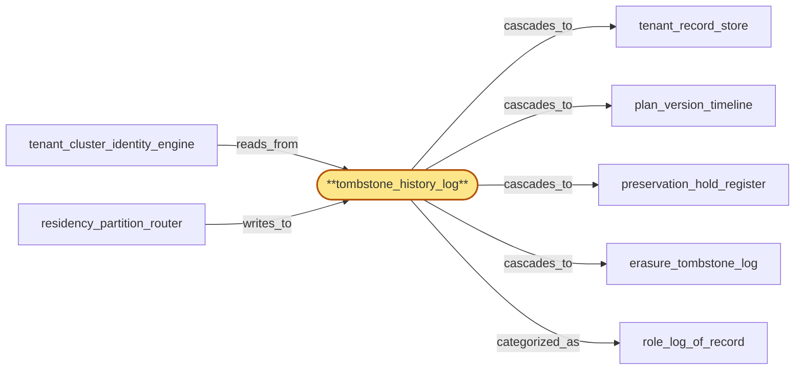

# tombstone_history_log

> Build the master tombstone history log:

## Properties

| Field | Value |
| --- | --- |
| Task | `tombstone_history_log` |
| Scope | `tenant_store` |
| Node | `tombstone_history_log` |
| Node type | `Log` |
| Dependencies | `4` |
| Wave | `3` |

## Architecture

## Implementation summary

- Build the master tombstone history log: append-only Postgres log of every tombstone (revocation, plan-supersede, preservation-hold-expiry, erasure) cascading to derived stores
- supports replay-idempotency and post-erasure write rejection with checkpoints.

## Node definition (`tombstone_history_log` — Log)

- Append-only globally-ordered history log of every tombstoned event (key revocation, plan change, cluster suspension, preservation hold, erasure) keyed by (tenant_id, event_kind, hlc, originator_id).
- Tombstones are not subject to last-write-wins.
- Supports per-(tenant, event_kind) durable replay-checkpoints that are themselves immutable and signed
- tombstones older than the most recent shared checkpoint of every dependent sub-node may be archived to cold storage but never deleted
- replay always begins at the most recent shared checkpoint.
- Enforces deterministic per-(tenant, data_class) ordering for preservation-vs-erasure: when a preservation_hold and an erasure_tombstone for overlapping scope land in the same HLC tick, preservation_hold is ordered first regardless of source-side timestamp.
- Enforces a per-tenant terminal-state: once an erasure tombstone for tenant T is committed at HLC T_e, any subsequent cascade for that tenant with HLC > T_e is rejected with documented post-erasure reason
- cascades whose HLC < T_e but arrive late are applied only to a frozen audit-projection used for audit reconstruction, never to live tenant_record_store / plan_version_timeline.
- All replay-from-log is idempotent-keyed on (tenant, event_kind, hlc, originator_id)
- during replay, sub-nodes maintain a replay-cursor and a live-events buffer
- live cascades during replay are buffered and applied strictly after the replay-cursor passes their HLC
- replay completion publishes the cursor as the new durable checkpoint.

## Requirements

### `r1` — R-revocation-tombstone

**Summary:** Key and tenant revocations are stored as tombstones with global ordering so any region auth_cache hydration sees a revocation regardless of replication lag direction

- Origin: `initial`
- Targets: `tombstone_history_log`
- Matched via: `tombstone_history_log`
- Verifications:
  - Integration test asserting a revocation tombstone is recorded with idempotency_key; replays do not duplicate cascades on tenant_record_store.

### `r2` — R-ts-tombstone-checkpoint

**Summary:** tombstone_history_log supports per-(tenant, event_kind) durable replay-checkpoints that are themselves immutable and signed; tombstones older than the most recent shared replay-checkpoint of every dependent sub-node may be archived to cold storage but never deleted; replay always starts from the most recent shared checkpoint.

- Origin: `stressor:1:ts-tombstone-compaction`
- Targets: `tombstone_history_log`
- Matched via: `tombstone_history_log`
- Verifications:
  - Integration test asserting checkpoint advancement: after a successful replay window, latest_checkpoint(target) advances monotonically and a subsequent replay starts from the new checkpoint.

### `r3` — R-ts-replay-idempotency

**Summary:** every replay-from-log is idempotent-keyed on (tenant, event_kind, hlc, originator_id); during replay, sub-nodes maintain a replay-cursor and a live-events buffer; live cascades are buffered and applied strictly after the replay-cursor passes their HLC; replay completion publishes the cursor as the new durable checkpoint.

- Origin: `stressor:1:ts-tombstone-replay-on-restart`
- Targets: `tombstone_history_log`
- Matched via: `tombstone_history_log`
- Verifications:
  - Replay-idempotency test: replay the same window twice and assert downstream cascades report exactly-one effect (e.g., one delete in tenant_record_store).

### `r4` — R-ts-post-erasure-rejection

**Summary:** tombstone_history_log enforces a per-tenant terminal-state: once an erasure tombstone for tenant T is committed at HLC T_e, any subsequent cascade for that tenant whose HLC > T_e is rejected at the log with documented post-erasure reason; cascades whose HLC < T_e but arrive late are applied to a frozen audit-projection only, never to live tenant_record_store / plan_version_timeline.

- Origin: `stressor:1:ts-tombstone-log-causality-violation`
- Targets: `tombstone_history_log`
- Matched via: `tombstone_history_log`
- Verifications:
  - Integration test asserting that a write to tenant_record_store for a tenant with an active erasure tombstone is rejected at admission with a documented post-erasure error code.

## Outputs

| Path | Purpose |
| --- | --- |
| `crates/tenant_store/migrations/0006_tombstone_history.sql` | Migration creating tombstone_history log + checkpoint table |
| `crates/tenant_store/src/tombstone_history.rs` | Rust API with append/replay/checkpoint primitives |

## Stack details

- Postgres 'tenants.tombstone_history' table (id PK, tenant_id, tombstone_kind enum, body JSONB, hlc, idempotency_key UNIQUE, cascade_targets[]) — REVOKE UPDATE/DELETE
- Rust API: append_tombstone (idempotent on idempotency_key), replay_from_checkpoint(checkpoint_hlc, target_store), latest_checkpoint(target)
- Cascade workers consume the log and write to plan_version_timeline / preservation_hold_register / erasure_tombstone_log / tenant_record_store; checkpoints persisted per target

## Acceptance criteria

### R-revocation-tombstone

- Integration test asserting a revocation tombstone is recorded with idempotency_key; replays do not duplicate cascades on tenant_record_store.

### R-ts-tombstone-checkpoint

- Integration test asserting checkpoint advancement: after a successful replay window, latest_checkpoint(target) advances monotonically and a subsequent replay starts from the new checkpoint.

### R-ts-replay-idempotency

- Replay-idempotency test: replay the same window twice and assert downstream cascades report exactly-one effect (e.g., one delete in tenant_record_store).

### R-ts-post-erasure-rejection

- Integration test asserting that a write to tenant_record_store for a tenant with an active erasure tombstone is rejected at admission with a documented post-erasure error code.

## Related tasks (graph neighbours)

- [erasure_tombstone_log](erasure_tombstone_log.md)
- [plan_version_timeline](plan_version_timeline.md)
- [preservation_hold_register](preservation_hold_register.md)
- [residency_partition_router](residency_partition_router.md)
- [role_log_of_record](role_log_of_record.md)
- [tenant_cluster_identity_engine](tenant_cluster_identity_engine.md)
- [tenant_record_store](tenant_record_store.md)

---

_Source of truth: `archi plan task show tombstone_history_log`. Regenerate with `python3 tasks/_generate.py`._
