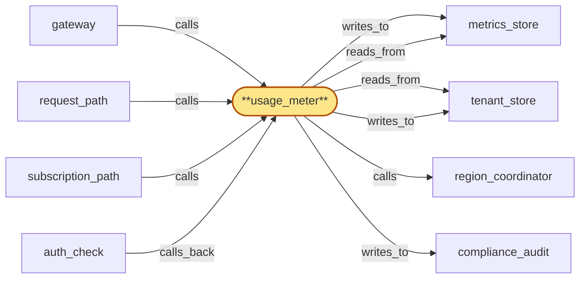

# usage_meter

> Build the usage_meter service:

## Properties

| Field | Value |
| --- | --- |
| Task | `usage_meter` |
| Scope | `/` |
| Node | `usage_meter` |
| Node type | `Service` |
| Dependencies | `4` |
| Wave | `6` |

## Architecture

## Implementation summary

- Build the usage_meter service: aggregates per-tenant cost-driver signals from gateway request_path/subscription_path/auth_check (rejected-request signal too)
- writes to metrics_store TimescaleDB hypertables
- reports cross-region deltas to region_coordinator's quota_aggregator over tonic gRPC
- cost attribution carries (tenant, plan_version, tenant_cluster)
- enforces three lease deny classes when accepting writes.

## Node definition (`usage_meter` — Service)

- Per-region usage and quota meter: ingests every authenticated request's usage signal from gateway, attributes cost to (tenant, plan_version, tenant_cluster), aggregates rolling-window counters at sub-second cadence, and reports cross-region deltas to region_coordinator's flag_propagator so cluster-level throttle decisions converge across regions.
- Tags rejected-request signals with the rejection reason supplied by gateway and reports the same to metrics_store.
- WRITES TO TENANT_STORE under per-tenant single-writer lease: every write presents (record_version, lease_id) and is rejected if lease_id is older than the most recent observed for the tenant key.
- Distinct deny classes on writer-side: 'lease-stale' (lease TTL passed without renewal — resolves on fresh lease issuance from lease_issuer), 'lease-superseded' (lease TTL still valid but a more recent lease has been issued and tenant_store has fenced — resolves on re-acquiring a fresh lease), 'residency-miss' (policy_version mismatch — resolves on fresh policy_version ack from residency_publisher)
- the three deny classes are never collapsed in code paths or in observability. Subscribes to region_coordinator's residency_publisher push-and-acknowledge channel for the residency policy_version it pins on each report
- acks within the documented activation window and falls to deny-by-default (refuses to ingest writes for the affected tenant) on missed ack — sticky once the activation window has passed.
- ON COLD-START requests pre-warm hydration from residency_publisher delivering the currently-active policy_version's full state synchronously, ack-readies the active version inline as part of registration, and only after ack-readying begins serving residency-pinned writes
- pre-warm honors monotonic-per-(instance_id, version)
- on pre-warm-stalled falls to deny-by-default for residency-pinned operations and reports the state.
- Advances pinned policy_version only on observing strictly newer activation from residency_publisher's push-and-acknowledge channel
- out-of-band signals are not a valid activation source.
- CONSUMES drain-fence broadcasts: maintains a durable per-(offboarding_id, component_id) apply-state record with typed phase-markers (RECEIVED, FLUSH-IN-PROGRESS, FLUSH-COMPLETE, ACK-EMITTED, ATTESTATION-WRITTEN, TERMINAL)
- on restart resumes from the last durable phase and never re-runs a non-idempotent phase
- flushes in-flight audit writes for the named tenant to compliance_audit then acks drain to tenant_store within the HLC-bounded ack window
- if the local instance is itself in lifecycle teardown when the broadcast arrives, flush-then-ack-then-teardown is the only ordering that satisfies both invariants — alternatively a durable drain-ack-handoff record names a successor instance or persistent buffer and ack-by-handoff is recorded
- never retracts a drain-ack once emitted.
- On tenant offboarding, finalizes per-tenant counters and emits a closing accounting record on receipt of a region_coordinator-signed offboarding signal — rejects offboarding signals lacking a current valid lifecycle_gate signature, verifies the signature against the broadcast's NAMED roster_version not the locally-cached roster_version (broadcasts are self-contained credential bundles)
- deduping by idempotency key (offboarding_id, component_id, attempt_id), meeting a documented attestation SLO and surfacing preservation-blocked terminal states, with the attestation written to compliance_audit.
- Cert-bearing surface to gateway, region_coordinator's flag_propagator, and metrics_store, enumerated in cert-inventory

## Requirements

### `r1` — R-global-quota-aggregation

**Summary:** Per-tenant quota and cost-ceiling enforcement aggregates counters across all regions on a bounded sub-second cadence so that overshoot is bounded by aggregation latency, not by tenant_store replication lag

- Origin: `stressor:2:S-cross-region-quota-race`
- Targets: `usage_meter`
- Matched via: `usage_meter`
- Verifications:
  - Test usage_meter/global_quota_aggregation.rs asserts per-region per-tenant deltas are reported to region_coordinator's quota_aggregator within HLC-bounded window.

### `r2` — R-plan-version-cost-attribution

**Summary:** usage_meter tags every cost record with (tenant, plan_version) so that month-to-date cost is attributable to the plan that was in force at the time the cost was incurred. region_coordinator's monthly-ceiling computation aggregates by plan_version, then applies a documented reconciliation policy when plans change mid-period.

- Origin: `stressor:3:s3-plan-downgrade-race`
- Targets: `usage_meter`
- Matched via: `usage_meter`
- Verifications:
  - Test usage_meter/plan_version_cost_attribution.rs asserts every metrics_store write carries (tenant_id, plan_version, tenant_cluster).

### `r3` — R-cluster-level-quota

**Summary:** Free-tier and trial-tier global quotas are enforced at the tenant_cluster level, not only the per-tenant level. usage_meter aggregates cost and rate by cluster; the throttle-flag fast-path supports cluster-scoped throttle flags that propagate to every region's auth_cache like per-tenant flags do.

- Origin: `stressor:3:s3-signup-farm-abuse`
- Targets: `usage_meter`
- Matched via: `usage_meter`
- Verifications:
  - Test usage_meter/cluster_level_quota.rs asserts cluster-aggregated quota readings are computed and surfaced.

### `r4` — r-s5-lease-stale-distinct-deny

**Summary:** Writers to tenant_store under per-tenant single-writer lease (usage_meter at root scope; tenant_store internal writers at zoom scope) sticky-deny-by-default with a distinct 'lease-stale' deny reason once their currently-held lease passes its HLC-bounded TTL without renewal; this deny reason is enumerated separately from 'residency-miss' on every consumer surface (gateway rejected-request signal, usage_meter rejection tags, operator dashboards). 'lease-stale' resolves on fresh lease issuance from lease_issuer; 'residency-miss' resolves on fresh policy_version ack from residency_publisher; the two deny classes are never collapsed in writer code paths or in observability.

- Origin: `stressor:5:s5-lease-issuer-unavailable`
- Targets: `usage_meter`
- Matched via: `usage_meter`
- Verifications:
  - Test usage_meter/lease_stale_deny.rs asserts writes against a stale lease are rejected with deny-class=lease-stale.

### `r5` — r-s5-lease-superseded-deny

**Summary:** Writers submitting a write that fails tenant_store's CAS-on-lease (because their lease_id has been superseded by a fresher lease_v_new even though the writer's TTL was valid) receive a distinct 'lease-superseded' deny reason that is enumerated separately from 'lease-stale' and 'residency-miss'. 'lease-superseded' resolves only by re-acquiring a fresh lease (the old writer must observe the handoff and stop), not by waiting (which is 'lease-stale') or by acking a new policy_version (which is 'residency-miss'). The deny reason is propagated through gateway's rejected-request signal and usage_meter's rejection tags.

- Origin: `stressor:5:s5-lease-handoff-cas-race`
- Targets: `usage_meter`
- Matched via: `usage_meter`
- Verifications:
  - Test usage_meter/lease_superseded_deny.rs asserts writes against a superseded lease are rejected with deny-class=lease-superseded.

## Outputs

| Path | Purpose |
| --- | --- |
| `crates/usage_meter/` | Usage-meter service crate |
| `charts/services/usage-meter/` | Helm chart |

## Stack details

- Rust workspace crate 'crates/usage_meter' (tokio); per-tenant cost-driver aggregator running per-region; reports HLC-stamped deltas at sub-second cadence to region_coordinator
- Cost attribution tuple (tenant_id, plan_version, tenant_cluster) recorded in every metrics_store write; lease-stale / lease-superseded / residency-miss are documented deny classes

## Acceptance criteria

### R-global-quota-aggregation

- Test usage_meter/global_quota_aggregation.rs asserts per-region per-tenant deltas are reported to region_coordinator's quota_aggregator within HLC-bounded window.

### R-plan-version-cost-attribution

- Test usage_meter/plan_version_cost_attribution.rs asserts every metrics_store write carries (tenant_id, plan_version, tenant_cluster).

### R-cluster-level-quota

- Test usage_meter/cluster_level_quota.rs asserts cluster-aggregated quota readings are computed and surfaced.

### r-s5-lease-stale-distinct-deny

- Test usage_meter/lease_stale_deny.rs asserts writes against a stale lease are rejected with deny-class=lease-stale.

### r-s5-lease-superseded-deny

- Test usage_meter/lease_superseded_deny.rs asserts writes against a superseded lease are rejected with deny-class=lease-superseded.

## Related tasks (graph neighbours)

- [compliance_audit_integration](compliance_audit/README.md)
- [gateway_integration](gateway/README.md)
- [metrics_store](metrics_store.md)
- [region_coordinator_integration](region_coordinator/README.md)
- [tenant_store_integration](tenant_store/README.md)

---

_Source of truth: `archi plan task show usage_meter`. Regenerate with `python3 tasks/_generate.py`._
