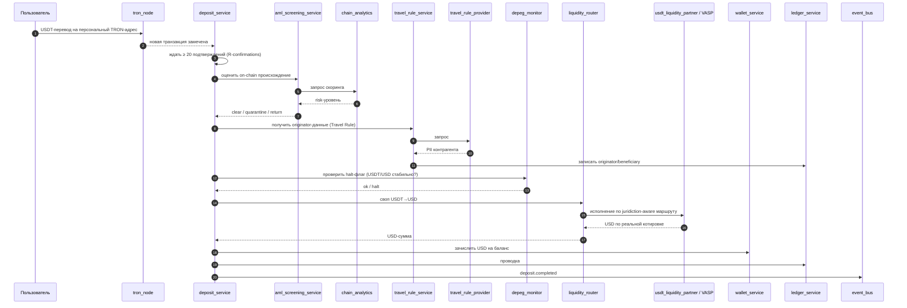
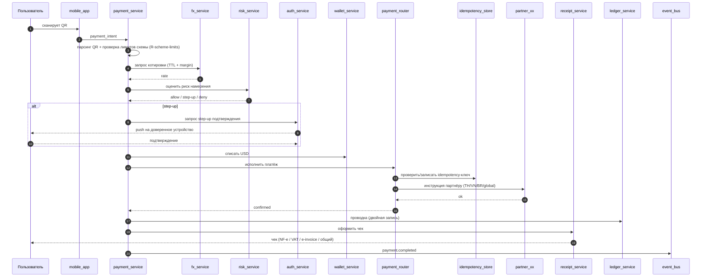
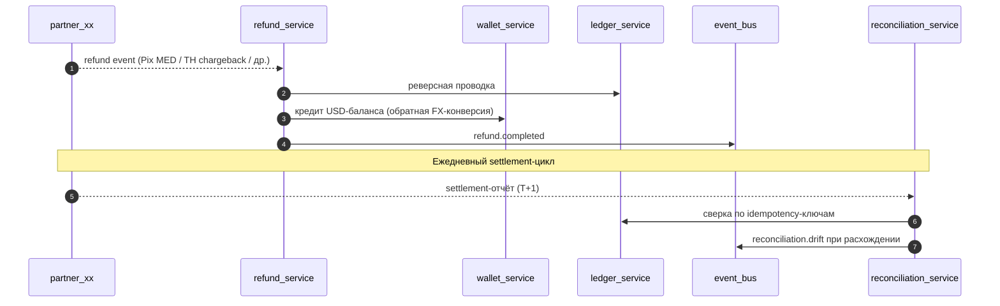

# Кошелёк USDT→фиат с QR-оплатой по миру — архитектурный отчёт

Версия spec: **v1** (после первой стресс-итерации)
Сессия: archi (epistatic layer, ontology + 14 стрессоров)
Целевые юрисдикции: **Тайланд (PromptPay), Вьетнам (VietQR/NAPAS 247), Бразилия (Pix)** + кросс-бордер (Alipay+/UPI и др.)

---

## 1. Постановка проблемы

Мобильный кошелёк (**не криптокошелёк**), который позволяет пользователю расплачиваться в локальной фиатной валюте по QR-кодам торговцев в Тайланде, Вьетнаме, Бразилии и по интероп-схемам в остальных странах. Пополнение баланса — депозитом **USDT (TRC-20 на TRON)**: крипта мгновенно конвертируется в USD и зачисляется на единый USD-баланс. На момент платежа выполняется конверсия USD→локальный фиат с фиксацией курса. Подключение к локальным платёжным сетям — через лицензированных партнёров-эквайеров. KYC до уровней регулятора, история и фискальные чеки. P2P между пользователями вне scope.

---

## 2. Сводка модели

| Метрика | Значение |
|---|---|
| Узлов | 40 |
| Рёбер | ~60 |
| **Регим NKP** | **CRITICAL** |
| K̄ (среднее число связей) | 1.50 |
| P̄ (эволюционируемость) | 0.75 |
| Modularity | 0.97 |
| Стрессоров (итерация 1) | 14 (все breaking) |
| Требований всего | 34 (11 initial + 23 derived) |

**Hotspots (по NKP):** `ledger_service` (K=6), `event_bus` (K=5), `wallet_service` (K=4), `partner_th/vn/br/global` (K=3 каждый).

---

## 3. Полная архитектура

```mermaid
graph TB
    subgraph Client["Клиент"]
        mobile_app["mobile_app"]
    end
    subgraph Edge["Edge / API"]
        api_gateway["api_gateway"]
    end
    subgraph Core["Core Services"]
        auth_service["auth_service"]
        kyc_service["kyc_service"]
        wallet_service["wallet_service"]
        deposit_service["deposit_service"]
        payment_service["payment_service"]
        fx_service["fx_service"]
        ledger_service["ledger_service"]
    end
    subgraph Routing["Routing"]
        liquidity_router["liquidity_router"]
        payment_router["payment_router"]
    end
    subgraph Risk["Compliance & Risk"]
        travel_rule_service["travel_rule_service"]
        aml_screening_service["aml_screening_service"]
        depeg_monitor["depeg_monitor"]
        risk_service["risk_service"]
    end
    subgraph Ops["Operations"]
        refund_service["refund_service"]
        reconciliation_service["reconciliation_service"]
        receipt_service["receipt_service"]
        event_bus["event_bus"]
    end
    subgraph Stores["Stores"]
        user_db[("user_db")]
        wallet_db[("wallet_db")]
        ledger_db[("ledger_db")]
        usdt_buffer[("usdt_buffer")]
        idempotency_store[("idempotency_store")]
        fx_position_store[("fx_position_store")]
        device_trust_store[("device_trust_store")]
    end
    subgraph Chain["Crypto / Chain"]
        tron_node{{"tron_node"}}
        chain_analytics{{"chain_analytics"}}
    end
    subgraph Liquidity["USDT Liquidity"]
        usdt_liquidity_partner{{"usdt_liquidity_partner"}}
        vasp_partner_th{{"vasp_partner_th"}}
        vasp_partner_vn{{"vasp_partner_vn"}}
        vasp_partner_br{{"vasp_partner_br"}}
    end
    subgraph Acquirers["QR Acquirers"]
        partner_th{{"partner_th"}}
        partner_vn{{"partner_vn"}}
        partner_br{{"partner_br"}}
        partner_global{{"partner_global"}}
    end
    subgraph Providers["Compliance & FX Providers"]
        travel_rule_provider{{"travel_rule_provider"}}
        kyc_provider{{"kyc_provider"}}
        fiscal_provider{{"fiscal_provider"}}
        fx_provider{{"fx_provider"}}
    end

    mobile_app --> api_gateway
    api_gateway --> auth_service
    api_gateway --> kyc_service
    api_gateway --> wallet_service
    api_gateway --> payment_service
    api_gateway --> deposit_service

    auth_service --> user_db
    auth_service --> device_trust_store
    kyc_service --> user_db
    kyc_service --> kyc_provider

    wallet_service --> wallet_db
    wallet_service --> ledger_service

    deposit_service --> tron_node
    deposit_service --> aml_screening_service
    deposit_service --> travel_rule_service
    deposit_service --> depeg_monitor
    deposit_service --> liquidity_router
    deposit_service --> wallet_service
    deposit_service --> ledger_service
    deposit_service --> event_bus

    aml_screening_service --> chain_analytics
    travel_rule_service --> travel_rule_provider
    travel_rule_service --> ledger_service
    depeg_monitor --> usdt_liquidity_partner

    liquidity_router --> usdt_liquidity_partner
    liquidity_router --> vasp_partner_th
    liquidity_router --> vasp_partner_vn
    liquidity_router --> vasp_partner_br
    liquidity_router --> usdt_buffer

    payment_service --> wallet_service
    payment_service --> fx_service
    payment_service --> risk_service
    payment_service --> payment_router
    payment_service --> receipt_service
    payment_service --> ledger_service
    payment_service --> event_bus

    risk_service --> device_trust_store
    fx_service --> fx_provider
    fx_service --> fx_position_store

    payment_router --> partner_th
    payment_router --> partner_vn
    payment_router --> partner_br
    payment_router --> partner_global
    payment_router --> idempotency_store

    receipt_service --> fiscal_provider

    refund_service --> wallet_service
    refund_service --> ledger_service
    refund_service --> partner_th
    refund_service --> partner_vn
    refund_service --> partner_br
    refund_service --> partner_global
    refund_service --> event_bus

    reconciliation_service --> ledger_service
    reconciliation_service --> partner_th
    reconciliation_service --> partner_vn
    reconciliation_service --> partner_br
    reconciliation_service --> partner_global
    reconciliation_service --> event_bus

    ledger_service --> ledger_db
    ledger_service --> event_bus
```

---

## 4. Ключевые потоки

### 4.1 Депозит USDT → USD-баланс



### 4.2 Платёж по QR



### 4.3 Возврат и сверка



---

## 5. Узлы по доменам

| Домен | Узлы |
|---|---|
| **Client** | `mobile_app` |
| **Edge** | `api_gateway` |
| **Core** | `auth_service`, `kyc_service`, `wallet_service`, `deposit_service`, `payment_service`, `fx_service`, `ledger_service` |
| **Routing** | `liquidity_router`, `payment_router` |
| **Compliance / Risk** | `travel_rule_service`, `aml_screening_service`, `depeg_monitor`, `risk_service` |
| **Operations** | `refund_service`, `reconciliation_service`, `receipt_service`, `event_bus` |
| **Stores** | `user_db`, `wallet_db` (sharded), `ledger_db` (sharded + CQRS), `usdt_buffer`, `idempotency_store`, `fx_position_store`, `device_trust_store` |
| **Crypto / Chain** | `tron_node`, `chain_analytics` |
| **USDT Liquidity** | `usdt_liquidity_partner` (off-shore пул), `vasp_partner_th`, `vasp_partner_vn`, `vasp_partner_br` (on-shore VASP) |
| **QR Acquirers** | `partner_th` (PromptPay), `partner_vn` (VietQR), `partner_br` (Pix), `partner_global` (Alipay+/UPI и др.) |
| **Compliance & FX Providers** | `travel_rule_provider`, `kyc_provider`, `fiscal_provider`, `fx_provider` |

---

## 6. Требования

### 6.1 Initial (origin=initial, 11)

| ID | Описание | Цели |
|---|---|---|
| R-pay-qr-th | Оплата по Thai QR (PromptPay) | payment_service, partner_th |
| R-pay-qr-vn | Оплата по VietQR/NAPAS 247 | payment_service, partner_vn |
| R-pay-qr-br | Оплата по Pix QR | payment_service, partner_br |
| R-pay-qr-cross | Оплата по интероп QR (Alipay+/UPI/др.) | payment_service, partner_global |
| R-topup-usdt | Пополнение USDT (TRC-20) | deposit_service, tron_node |
| R-conv-usdt-usd | Мгновенная конверсия USDT→USD | deposit_service, usdt_liquidity_partner |
| R-balance-usd | Единый USD-баланс | wallet_service, wallet_db |
| R-fx-usd-local | Фиксация FX USD↔локальная на момент платежа | fx_service, fx_provider |
| R-kyc | KYC до уровней юрисдикции | kyc_service, kyc_provider |
| R-history | История операций и чеки | ledger_service, ledger_db |
| R-partner-acquiring | Только лицензированные партнёры | partner_th/vn/br/global |

### 6.2 Derived (origin=stressor, 23)

| ID | Стрессор | Краткая суть |
|---|---|---|
| R-vasp-jurisdiction | S-bot-vasp | On-shore VASP per страна |
| R-kyc-jurisdiction | S-bot-vasp | KYC = max(резидентство, использование) |
| R-travel-rule | S-travel-rule | Originator-данные обязательны |
| R-ledger-pii | S-travel-rule | PII в проводках |
| R-liquidity-multi | S-liquidity-down | ≥ 2 ликвидити-партнёров |
| R-usdt-buffer | S-liquidity-down | USDT-буфер с лимитом и алертами |
| R-partner-redundancy | S-partner-outage | ≥ 2 эквайеров на юрисдикцию |
| R-payment-idempotency | S-partner-outage | Idempotency на платёжное намерение |
| R-usdt-real-rate | S-usdt-depeg | Реальная котировка, не 1:1 |
| R-depeg-halt | S-usdt-depeg | Halt при отклонении выше порога |
| R-fx-quote-window | S-fx-slippage | TTL котировки + ревалидация |
| R-fx-margin | S-fx-slippage | Margin + лимиты экспозиции |
| R-aml-screening | S-aml-dirty-usdt | On-chain скоринг до конверсии |
| R-aml-quarantine | S-aml-dirty-usdt | Карантин и возврат high-risk |
| R-confirmations | S-tron-reorg | ≥ 20 подтверждений TRON |
| R-refund | S-merchant-refund | Авто-обработка возвратов |
| R-risk-scoring | S-account-takeover | Риск-скоринг каждого платежа |
| R-step-up-auth | S-account-takeover | Step-up + device_trust |
| R-reconciliation | S-reconciliation-drift | Ежедневная сверка с партнёрами |
| R-scheme-limits | S-promptpay-limits | Проверка лимитов схемы до фиксации курса |
| R-async-fanout | S-load-spike | event_bus для побочных эффектов |
| R-shard-by-user | S-load-spike | Шардирование по user_id |
| R-fiscal-receipts | S-tax-receipts | NF-e / VAT / e-invoice |

---

## 7. Стрессоры (итерация 1)

Все 14 стрессоров — **breaking** (наивная архитектура их не выдерживала). После итерации 1 каждый имеет производные требования и удовлетворён.

| ID | Угол | Аттрактор |
|---|---|---|
| S-bot-vasp | Регулирование TH (VASP-лицензии) | Все TH-платежи останавливаются; конкуренты с лицензией забирают рынок |
| S-travel-rule | FATF Travel Rule | Депозиты выше порога замораживаются; штрафы регулятора |
| S-liquidity-down | Отказ ликвидити-партнёра | Депозиты застревают; кошелёк становится держателем USDT |
| S-partner-outage | Отказ Pix-эквайера | Очередь pending; двойные списания при ретраях |
| S-usdt-depeg | Депег стейблкоина | Прямые убытки или ущемление пользователей |
| S-fx-slippage | FX-проскальзывание | Убытки или внезапные отмены платежей |
| S-aml-dirty-usdt | Грязный USDT | Регулятор замораживает счета; партнёр-VASP отзывает интеграцию |
| S-tron-reorg | Реорг TRON / отмена tx | Двойной зачёт; кошелёк теряет средства |
| S-merchant-refund | Возврат от торговца / Pix MED | Деньги застревают; пользователь не получает refund |
| S-account-takeover | Компрометация аккаунта | Массовые потери средств; платежи необратимы |
| S-reconciliation-drift | Накопление расхождений с партнёром | Бухгалтерия теряет контроль; аудит проваливается |
| S-promptpay-limits | Лимиты схемы | Платежи отклоняются после фиксации курса |
| S-load-spike | Пик нагрузки | Деградация UX в момент маркетингового запуска |
| S-tax-receipts | Локальные фискальные требования | Невозможно использовать кошелёк для бизнес-расходов |

---

## 8. Incidence-аналитика (alerts)

| Findings | Узлы | Сигнал |
|---|---|---|
| **HYPERLIMINAL_COUPLING** | `ledger_service` ↔ `usdt_liquidity_partner` | Co-react под 3 стрессорами (Travel Rule, liquidity-down, USDT-depeg), но нет короткого epistatic-пути между ними. Скрытая зависимость в потоке депозита. |
| **MERGE_CANDIDATE** | `ledger_db` ↔ `wallet_db` | Jaccard=1.0 под S-load-spike. Идентичная стресс-реакция → возможный общий "финансовый shard"-домен. |
| **STRESS_HOTSPOT** | `ledger_service`, `wallet_service`, `partner_th`, `partner_br` | Узлы под максимальным стрессом — кандидаты на nesting (раскрытие внутренней архитектуры). |

---

## 9. Что осталось вне scope / задел на будущее

- **P2P-переводы между пользователями** — намеренно не моделируется в v1.
- **Nesting тяжёлых хабов**: `ledger_service` (двойная запись, сверка, реверсы, корректировки) и `wallet_service` (балансы, holds, авторизации) заслуживают отдельной spec-сессии.
- **Стрессоры второй итерации** (приватность данных LGPD/PDPA, отказ event_bus, hot-shard, currency control в VN/BR, оффлайн-QR) — следующая итерация.
- **Plan**: после следующей итерации можно генерировать implementation plan через `archi plan` с верификациями на каждое требование.

---

*Сгенерировано из spec v1 после стресс-сессии 1. Источник: `archi query visualize --layer epistatic`, `archi req list`, `archi stress show`, `archi check`, `archi query incidence-findings`.*
